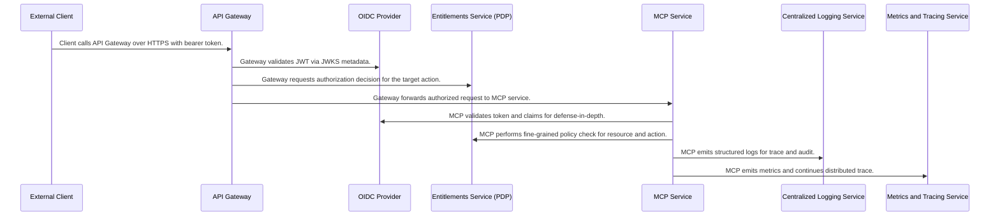

## Details

| Field               | Value                    |
|---------------------|--------------------------|
| **Unique ID**       | end-to-end-secure-and-observable                   |
| **Name**            | End-to-end secure, authorized, and observable request                 |
| **Description**     | OAuth, edge protections, token validation, policy decisions, logging, metrics, and tracing with comprehensive AIR governance controls.          |

## Sequence Diagram

## Controls
    _No controls defined._

## Metadata
  _No Metadata defined._
