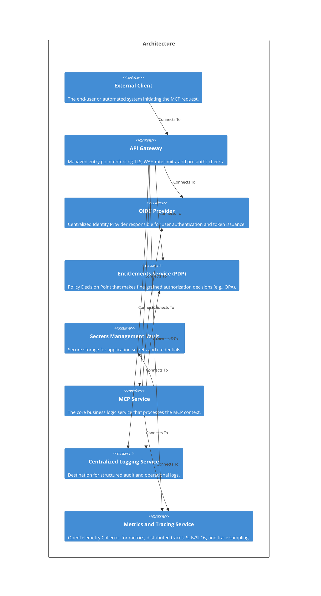

# Welcome to CALM Documentation

This documentation is generated from the **CALM Architecture-as-Code** model.

## High Level Architecture

## Nodes
    - [External Client](nodes/external-client)
    - [API Gateway](nodes/api-gateway)
    - [OIDC Provider](nodes/oidc-provider)
    - [Entitlements Service (PDP)](nodes/entitlements-pdp)
    - [Secrets Management Vault](nodes/secrets-vault)
    - [MCP Service](nodes/mcp-service)
    - [Centralized Logging Service](nodes/logging-service)
    - [Metrics and Tracing Service](nodes/metrics-tracing-service)

## Relationships
    - [Client To Gateway](relationships/client-to-gateway)
    - [Gateway Validates Jwt](relationships/gateway-validates-jwt)
    - [Gateway To Pdp](relationships/gateway-to-pdp)
    - [Gateway To Mcp](relationships/gateway-to-mcp)
    - [Mcp To Vault](relationships/mcp-to-vault)
    - [Gateway To Logging](relationships/gateway-to-logging)
    - [Mcp To Logging](relationships/mcp-to-logging)
    - [Gateway To Metrics](relationships/gateway-to-metrics)
    - [Mcp To Metrics](relationships/mcp-to-metrics)
    - [Mcp To Pdp](relationships/mcp-to-pdp)
    - [Mcp Validates Jwks](relationships/mcp-validates-jwks)

## Flows
    - [End-to-end secure, authorized, and observable request](flows/end-to-end-secure-and-observable)

## Controls
| ID    | Name             | Description                  | Domain    | Scope        | Applied To                |
|-------|------------------|------------------------------|-----------|--------------|---------------------------|
|AIR-PREV-012||Implement granular access controls for AI data and model access.|oauth-authorization|Node|external-client|
|AIR-PREV-012||Implement granular access controls for AI data and model access.|fine-grained-authorization|Node|api-gateway|
|AIR-PREV-012||Implement granular access controls for AI data and model access.|oauth-authorization|Node|oidc-provider|
|AIR-PREV-012||Implement granular access controls for AI data and model access.|fine-grained-authorization|Node|entitlements-pdp|
|AIR-PREV-012||Implement granular access controls for AI data and model access.|fine-grained-authorization|Node|mcp-service|
|AIR-PREV-012||Implement granular access controls for AI data and model access.|oauth-authorization|Relationship|client-to-gateway|
|AIR-PREV-012||Implement granular access controls for AI data and model access.|oauth-authorization|Relationship|gateway-validates-jwt|
|AIR-PREV-012||Implement granular access controls for AI data and model access.|fine-grained-authorization|Relationship|gateway-to-pdp|
|AIR-PREV-012||Implement granular access controls for AI data and model access.|fine-grained-authorization|Relationship|gateway-to-mcp|
|AIR-PREV-012||Implement granular access controls for AI data and model access.|fine-grained-authorization|Relationship|mcp-to-pdp|
|AIR-PREV-012||Implement granular access controls for AI data and model access.|fine-grained-authorization|Relationship|mcp-validates-jwks|
|AIR-PREV-001||Conduct comprehensive risk assessments for AI systems before deployment.|secrets-management|Node|api-gateway|
|AIR-PREV-001||Conduct comprehensive risk assessments for AI systems before deployment.|secrets-management|Node|secrets-vault|
|AIR-PREV-001||Conduct comprehensive risk assessments for AI systems before deployment.|secrets-management|Node|mcp-service|
|AIR-PREV-002||Sanitize and filter data from external sources to prevent sensitive information leakage.|secrets-management|Node|api-gateway|
|AIR-PREV-002||Sanitize and filter data from external sources to prevent sensitive information leakage.|data-governance|Node|api-gateway|
|AIR-PREV-002||Sanitize and filter data from external sources to prevent sensitive information leakage.|prompt-injection-protection|Node|api-gateway|
|AIR-PREV-002||Sanitize and filter data from external sources to prevent sensitive information leakage.|secrets-management|Node|secrets-vault|
|AIR-PREV-002||Sanitize and filter data from external sources to prevent sensitive information leakage.|secrets-management|Node|mcp-service|
|AIR-PREV-002||Sanitize and filter data from external sources to prevent sensitive information leakage.|data-governance|Node|mcp-service|
|AIR-PREV-002||Sanitize and filter data from external sources to prevent sensitive information leakage.|prompt-injection-protection|Node|mcp-service|
|AIR-PREV-002||Sanitize and filter data from external sources to prevent sensitive information leakage.|data-governance|Node|logging-service|
||||data-governance|Node|api-gateway|
||||resilience-and-reliability|Node|api-gateway|
||||edge-protection|Node|api-gateway|
||||prompt-injection-protection|Node|api-gateway|
||||observability-metrics-tracing|Node|api-gateway|
||||data-governance|Node|mcp-service|
||||resilience-and-reliability|Node|mcp-service|
||||prompt-injection-protection|Node|mcp-service|
||||ai-output-validation|Node|mcp-service|
||||observability-metrics-tracing|Node|mcp-service|
||||data-governance|Node|logging-service|
||||ai-output-validation|Node|metrics-tracing-service|
||||observability-metrics-tracing|Node|metrics-tracing-service|
||||edge-protection|Relationship|client-to-gateway|
||||edge-protection|Relationship|gateway-to-mcp|
||||resilience-and-reliability|Relationship|gateway-to-mcp|
||||resilience-and-reliability|Relationship|mcp-to-pdp|
|AIR-CORR-001||Establish procedures for responding to AI system incidents and failures.|resilience-and-reliability|Node|api-gateway|
|AIR-CORR-001||Establish procedures for responding to AI system incidents and failures.|resilience-and-reliability|Node|mcp-service|
|AIR-CORR-001||Establish procedures for responding to AI system incidents and failures.|resilience-and-reliability|Relationship|gateway-to-mcp|
|AIR-CORR-001||Establish procedures for responding to AI system incidents and failures.|resilience-and-reliability|Relationship|mcp-to-pdp|
|AIR-PREV-003||Monitor and filter interactions between users, applications, and AI models.|edge-protection|Node|api-gateway|
|AIR-PREV-003||Monitor and filter interactions between users, applications, and AI models.|prompt-injection-protection|Node|api-gateway|
|AIR-PREV-003||Monitor and filter interactions between users, applications, and AI models.|fine-grained-authorization|Node|api-gateway|
|AIR-PREV-003||Monitor and filter interactions between users, applications, and AI models.|fine-grained-authorization|Node|entitlements-pdp|
|AIR-PREV-003||Monitor and filter interactions between users, applications, and AI models.|prompt-injection-protection|Node|mcp-service|
|AIR-PREV-003||Monitor and filter interactions between users, applications, and AI models.|fine-grained-authorization|Node|mcp-service|
|AIR-PREV-003||Monitor and filter interactions between users, applications, and AI models.|edge-protection|Relationship|client-to-gateway|
|AIR-PREV-003||Monitor and filter interactions between users, applications, and AI models.|fine-grained-authorization|Relationship|gateway-to-pdp|
|AIR-PREV-003||Monitor and filter interactions between users, applications, and AI models.|edge-protection|Relationship|gateway-to-mcp|
|AIR-PREV-003||Monitor and filter interactions between users, applications, and AI models.|fine-grained-authorization|Relationship|gateway-to-mcp|
|AIR-PREV-003||Monitor and filter interactions between users, applications, and AI models.|fine-grained-authorization|Relationship|mcp-to-pdp|
|AIR-PREV-003||Monitor and filter interactions between users, applications, and AI models.|fine-grained-authorization|Relationship|mcp-validates-jwks|
|AIR-DET-004||Implement comprehensive monitoring to detect anomalies and security breaches.|observability-logging|Node|api-gateway|
|AIR-DET-004||Implement comprehensive monitoring to detect anomalies and security breaches.|observability-metrics-tracing|Node|api-gateway|
|AIR-DET-004||Implement comprehensive monitoring to detect anomalies and security breaches.|ai-output-validation|Node|mcp-service|
|AIR-DET-004||Implement comprehensive monitoring to detect anomalies and security breaches.|observability-logging|Node|mcp-service|
|AIR-DET-004||Implement comprehensive monitoring to detect anomalies and security breaches.|observability-metrics-tracing|Node|mcp-service|
|AIR-DET-004||Implement comprehensive monitoring to detect anomalies and security breaches.|observability-logging|Node|logging-service|
|AIR-DET-004||Implement comprehensive monitoring to detect anomalies and security breaches.|ai-output-validation|Node|metrics-tracing-service|
|AIR-DET-004||Implement comprehensive monitoring to detect anomalies and security breaches.|observability-metrics-tracing|Node|metrics-tracing-service|
|AIR-DET-004||Implement comprehensive monitoring to detect anomalies and security breaches.|observability-logging|Relationship|gateway-to-logging|
|AIR-DET-004||Implement comprehensive monitoring to detect anomalies and security breaches.|observability-logging|Relationship|mcp-to-logging|
|AIR-DET-005||Maintain comprehensive audit trails for AI system decisions and actions.|observability-logging|Node|api-gateway|
|AIR-DET-005||Maintain comprehensive audit trails for AI system decisions and actions.|observability-logging|Node|mcp-service|
|AIR-DET-005||Maintain comprehensive audit trails for AI system decisions and actions.|observability-logging|Node|logging-service|
|AIR-DET-005||Maintain comprehensive audit trails for AI system decisions and actions.|observability-logging|Relationship|gateway-to-logging|
|AIR-DET-005||Maintain comprehensive audit trails for AI system decisions and actions.|observability-logging|Relationship|mcp-to-logging|

## Metadata
  

      <table>
          <thead>
          <tr>
              <th>Key</th>
              <th>Value</th>
          </tr>
          </thead>
          <tbody>
          <tr>
              <td>
                  <b>Name</b>
              </td>
              <td>
                  Experimental - Enterprise MCP Golden Path with AIR Controls
                      </td>
          </tr>
          <tr>
              <td>
                  <b>Owners</b>
              </td>
              <td>
                  <ul>
                      <li>platform-security@company.example</li>
                      <li>sre@company.example</li>
                      <li>data-governance@company.example</li>
                      <li>ai-governance@company.example</li>
                  </ul>
              </td>
          </tr>
          <tr>
              <td>
                  <b>Tags</b>
              </td>
              <td>
                  <ul>
                      <li>mcp</li>
                      <li>enterprise</li>
                      <li>oauth2.1</li>
                      <li>oidc</li>
                      <li>authorization</li>
                      <li>opa</li>
                      <li>observability</li>
                      <li>logging</li>
                      <li>metrics</li>
                      <li>tracing</li>
                      <li>resilience</li>
                      <li>vault</li>
                      <li>finos-air</li>
                      <li>ai-governance</li>
                  </ul>
              </td>
          </tr>
          <tr>
              <td>
                  <b>Description</b>
              </td>
              <td>
                  A certified architectural pattern for deploying secure, observable, and resilient MCP services in a regulated environment with comprehensive FINOS AIR governance controls.
                      </td>
          </tr>
          </tbody>
      </table>
  

## Adrs
- [https://modelcontextprotocol.io/specification/](https://modelcontextprotocol.io/specification/)
- [https://www.rfc-editor.org/rfc/rfc8414](https://www.rfc-editor.org/rfc/rfc8414)
- [https://www.rfc-editor.org/rfc/rfc8725](https://www.rfc-editor.org/rfc/rfc8725)
- [https://github.com/Puliczek/awesome-mcp-security](https://github.com/Puliczek/awesome-mcp-security)
- [https://air-governance-framework.finos.org/](https://air-governance-framework.finos.org/)
