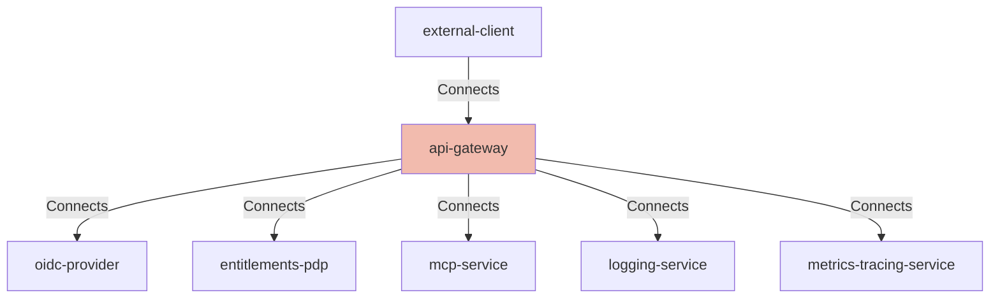

## Details

| Field               | Value                    |
|---------------------|--------------------------|
| **Unique ID**       | api-gateway                   |
| **Node Type**       | service             |
| **Name**            | API Gateway                 |
| **Description**     | Managed entry point enforcing TLS, WAF, rate limits, and pre-authz checks.          |

## Interfaces
        

            <table>
                <thead>
                <tr>
                    <th>Key</th>
                    <th>Value</th>
                </tr>
                </thead>
                <tbody>
                <tr>
                    <td>
                        <b>UniqueId</b>
                    </td>
                    <td>
                        gateway-https
                            </td>
                </tr>
                <tr>
                    <td>
                        <b>AdditionalProperties</b>
                    </td>
                    <td>
                        

                            <table>
                                <thead>
                                <tr>
                                    <th>Key</th>
                                    <th>Value</th>
                                </tr>
                                </thead>
                                <tbody>
                                </tbody>
                            </table>
                        

                    </td>
                </tr>
                </tbody>
            </table>
        

## Related Nodes

## Controls

        ### Secrets Management

        Centralized secrets with short-lived credentials and rotation through a vault.

            

                <table>
                    <thead>
                    <tr>
                        <th>Key</th>
                        <th>Value</th>
                    </tr>
                    </thead>
                    <tbody>
                    <tr>
                        <td>
                            <b>$id</b>
                        </td>
                        <td>
                            https://air-governance-framework.finos.org/calm/AIR-PREV-001
                                </td>
                    </tr>
                    <tr>
                        <td>
                            <b>Control Id</b>
                        </td>
                        <td>
                            AIR-PREV-001
                                </td>
                    </tr>
                    <tr>
                        <td>
                            <b>Control Name</b>
                        </td>
                        <td>
                            AI System Risk Assessment
                                </td>
                    </tr>
                    <tr>
                        <td>
                            <b>Category</b>
                        </td>
                        <td>
                            Preventative
                                </td>
                    </tr>
                    <tr>
                        <td>
                            <b>Description</b>
                        </td>
                        <td>
                            Conduct comprehensive risk assessments for AI systems before deployment.
                                </td>
                    </tr>
                    <tr>
                        <td>
                            <b>Reference Url</b>
                        </td>
                        <td>
                            https://air-governance-framework.finos.org/mitigations/mi-1_ai-system-risk-assessment.html
                                </td>
                    </tr>
                    <tr>
                        <td>
                            <b>Threats Mitigated</b>
                        </td>
                        <td>
                            <ul>
                            </ul>
                        </td>
                    </tr>
                    <tr>
                        <td>
                            <b>Implementation Requirements</b>
                        </td>
                        <td>
                            

                                <table>
                                    <thead>
                                    <tr>
                                        <th>Key</th>
                                        <th>Value</th>
                                    </tr>
                                    </thead>
                                    <tbody>
                                    </tbody>
                                </table>
                            

                        </td>
                    </tr>
                    </tbody>
                </table>
            

            

                <table>
                    <thead>
                    <tr>
                        <th>Key</th>
                        <th>Value</th>
                    </tr>
                    </thead>
                    <tbody>
                    <tr>
                        <td>
                            <b>$id</b>
                        </td>
                        <td>
                            https://air-governance-framework.finos.org/calm/AIR-PREV-002
                                </td>
                    </tr>
                    <tr>
                        <td>
                            <b>Control Id</b>
                        </td>
                        <td>
                            AIR-PREV-002
                                </td>
                    </tr>
                    <tr>
                        <td>
                            <b>Control Name</b>
                        </td>
                        <td>
                            Data Filtering From External Knowledge Bases
                                </td>
                    </tr>
                    <tr>
                        <td>
                            <b>Category</b>
                        </td>
                        <td>
                            Preventative
                                </td>
                    </tr>
                    <tr>
                        <td>
                            <b>Description</b>
                        </td>
                        <td>
                            Sanitize and filter data from external sources to prevent sensitive information leakage.
                                </td>
                    </tr>
                    <tr>
                        <td>
                            <b>Reference Url</b>
                        </td>
                        <td>
                            https://air-governance-framework.finos.org/mitigations/mi-2_data-filtering-from-external-knowledge-bases.html
                                </td>
                    </tr>
                    <tr>
                        <td>
                            <b>Threats Mitigated</b>
                        </td>
                        <td>
                            <ul>
                                <li>AIR-SEC-002</li>
                            </ul>
                        </td>
                    </tr>
                    <tr>
                        <td>
                            <b>Implementation Requirements</b>
                        </td>
                        <td>
                            

                                <table>
                                    <thead>
                                    <tr>
                                        <th>Key</th>
                                        <th>Value</th>
                                    </tr>
                                    </thead>
                                    <tbody>
                                    <tr>
                                        <td>
                                            <b>Data Governance</b>
                                        </td>
                                        <td>
                                            

                                                <table>
                                                    <thead>
                                                    <tr>
                                                        <th>Key</th>
                                                        <th>Value</th>
                                                    </tr>
                                                    </thead>
                                                    <tbody>
                                                    <tr>
                                                        <td>
                                                            <b>Classification</b>
                                                        </td>
                                                        <td>
                                                            <ul>
                                                                <li>public</li>
                                                                <li>internal</li>
                                                                <li>confidential</li>
                                                                <li>restricted</li>
                                                            </ul>
                                                        </td>
                                                    </tr>
                                                    <tr>
                                                        <td>
                                                            <b>Default Classification</b>
                                                        </td>
                                                        <td>
                                                            internal
                                                                </td>
                                                    </tr>
                                                    <tr>
                                                        <td>
                                                            <b>Purpose Limitation</b>
                                                        </td>
                                                        <td>
                                                            true
                                                                </td>
                                                    </tr>
                                                    <tr>
                                                        <td>
                                                            <b>Data Minimization</b>
                                                        </td>
                                                        <td>
                                                            true
                                                                </td>
                                                    </tr>
                                                    <tr>
                                                        <td>
                                                            <b>Access Review Days</b>
                                                        </td>
                                                        <td>
                                                            90
                                                                </td>
                                                    </tr>
                                                    <tr>
                                                        <td>
                                                            <b>Retention Policy</b>
                                                        </td>
                                                        <td>
                                                            

                                                                <table>
                                                                    <thead>
                                                                    <tr>
                                                                        <th>Key</th>
                                                                        <th>Value</th>
                                                                    </tr>
                                                                    </thead>
                                                                    <tbody>
                                                                    <tr>
                                                                        <td>
                                                                            <b>Internal</b>
                                                                        </td>
                                                                        <td>
                                                                            365
                                                                                </td>
                                                                    </tr>
                                                                    <tr>
                                                                        <td>
                                                                            <b>Confidential</b>
                                                                        </td>
                                                                        <td>
                                                                            180
                                                                                </td>
                                                                    </tr>
                                                                    <tr>
                                                                        <td>
                                                                            <b>Restricted</b>
                                                                        </td>
                                                                        <td>
                                                                            90
                                                                                </td>
                                                                    </tr>
                                                                    </tbody>
                                                                </table>
                                                            

                                                        </td>
                                                    </tr>
                                                    </tbody>
                                                </table>
                                            

                                        </td>
                                    </tr>
                                    </tbody>
                                </table>
                            

                        </td>
                    </tr>
                    </tbody>
                </table>
            

        ### Data Governance

        Data minimization, classification, retention, and purpose limitation aligned to FINOS AIR and regulatory requirements.

            

                <table>
                    <thead>
                    <tr>
                        <th>Key</th>
                        <th>Value</th>
                    </tr>
                    </thead>
                    <tbody>
                    <tr>
                        <td>
                            <b>$id</b>
                        </td>
                        <td>
                            https://air-governance-framework.finos.org/calm/AIR-PREV-002
                                </td>
                    </tr>
                    <tr>
                        <td>
                            <b>Control Id</b>
                        </td>
                        <td>
                            AIR-PREV-002
                                </td>
                    </tr>
                    <tr>
                        <td>
                            <b>Control Name</b>
                        </td>
                        <td>
                            Data Filtering From External Knowledge Bases
                                </td>
                    </tr>
                    <tr>
                        <td>
                            <b>Category</b>
                        </td>
                        <td>
                            Preventative
                                </td>
                    </tr>
                    <tr>
                        <td>
                            <b>Description</b>
                        </td>
                        <td>
                            Sanitize and filter data from external sources to prevent sensitive information leakage.
                                </td>
                    </tr>
                    <tr>
                        <td>
                            <b>Reference Url</b>
                        </td>
                        <td>
                            https://air-governance-framework.finos.org/mitigations/mi-2_data-filtering-from-external-knowledge-bases.html
                                </td>
                    </tr>
                    <tr>
                        <td>
                            <b>Threats Mitigated</b>
                        </td>
                        <td>
                            <ul>
                                <li>AIR-SEC-002</li>
                            </ul>
                        </td>
                    </tr>
                    <tr>
                        <td>
                            <b>Implementation Requirements</b>
                        </td>
                        <td>
                            

                                <table>
                                    <thead>
                                    <tr>
                                        <th>Key</th>
                                        <th>Value</th>
                                    </tr>
                                    </thead>
                                    <tbody>
                                    <tr>
                                        <td>
                                            <b>Data Governance</b>
                                        </td>
                                        <td>
                                            

                                                <table>
                                                    <thead>
                                                    <tr>
                                                        <th>Key</th>
                                                        <th>Value</th>
                                                    </tr>
                                                    </thead>
                                                    <tbody>
                                                    <tr>
                                                        <td>
                                                            <b>Classification</b>
                                                        </td>
                                                        <td>
                                                            <ul>
                                                                <li>public</li>
                                                                <li>internal</li>
                                                                <li>confidential</li>
                                                                <li>restricted</li>
                                                            </ul>
                                                        </td>
                                                    </tr>
                                                    <tr>
                                                        <td>
                                                            <b>Default Classification</b>
                                                        </td>
                                                        <td>
                                                            internal
                                                                </td>
                                                    </tr>
                                                    <tr>
                                                        <td>
                                                            <b>Purpose Limitation</b>
                                                        </td>
                                                        <td>
                                                            true
                                                                </td>
                                                    </tr>
                                                    <tr>
                                                        <td>
                                                            <b>Data Minimization</b>
                                                        </td>
                                                        <td>
                                                            true
                                                                </td>
                                                    </tr>
                                                    <tr>
                                                        <td>
                                                            <b>Access Review Days</b>
                                                        </td>
                                                        <td>
                                                            90
                                                                </td>
                                                    </tr>
                                                    <tr>
                                                        <td>
                                                            <b>Retention Policy</b>
                                                        </td>
                                                        <td>
                                                            

                                                                <table>
                                                                    <thead>
                                                                    <tr>
                                                                        <th>Key</th>
                                                                        <th>Value</th>
                                                                    </tr>
                                                                    </thead>
                                                                    <tbody>
                                                                    <tr>
                                                                        <td>
                                                                            <b>Internal</b>
                                                                        </td>
                                                                        <td>
                                                                            365
                                                                                </td>
                                                                    </tr>
                                                                    <tr>
                                                                        <td>
                                                                            <b>Confidential</b>
                                                                        </td>
                                                                        <td>
                                                                            180
                                                                                </td>
                                                                    </tr>
                                                                    <tr>
                                                                        <td>
                                                                            <b>Restricted</b>
                                                                        </td>
                                                                        <td>
                                                                            90
                                                                                </td>
                                                                    </tr>
                                                                    </tbody>
                                                                </table>
                                                            

                                                        </td>
                                                    </tr>
                                                    </tbody>
                                                </table>
                                            

                                        </td>
                                    </tr>
                                    </tbody>
                                </table>
                            

                        </td>
                    </tr>
                    </tbody>
                </table>
            

            

                <table>
                    <thead>
                    <tr>
                        <th>Key</th>
                        <th>Value</th>
                    </tr>
                    </thead>
                    <tbody>
                    </tbody>
                </table>
            

        ### Resilience And Reliability

        Timeouts, retries with backoff, circuit breaking, bulkheads, and active-active deployment for MCP service.

            

                <table>
                    <thead>
                    <tr>
                        <th>Key</th>
                        <th>Value</th>
                    </tr>
                    </thead>
                    <tbody>
                    <tr>
                        <td>
                            <b>$id</b>
                        </td>
                        <td>
                            https://air-governance-framework.finos.org/calm/AIR-CORR-001
                                </td>
                    </tr>
                    <tr>
                        <td>
                            <b>Control Id</b>
                        </td>
                        <td>
                            AIR-CORR-001
                                </td>
                    </tr>
                    <tr>
                        <td>
                            <b>Control Name</b>
                        </td>
                        <td>
                            AI System Incident Response
                                </td>
                    </tr>
                    <tr>
                        <td>
                            <b>Category</b>
                        </td>
                        <td>
                            Corrective
                                </td>
                    </tr>
                    <tr>
                        <td>
                            <b>Description</b>
                        </td>
                        <td>
                            Establish procedures for responding to AI system incidents and failures.
                                </td>
                    </tr>
                    <tr>
                        <td>
                            <b>Reference Url</b>
                        </td>
                        <td>
                            https://air-governance-framework.finos.org/mitigations/mi-6_ai-system-incident-response.html
                                </td>
                    </tr>
                    <tr>
                        <td>
                            <b>Threats Mitigated</b>
                        </td>
                        <td>
                            <ul>
                                <li>AIR-OP-020</li>
                            </ul>
                        </td>
                    </tr>
                    <tr>
                        <td>
                            <b>Implementation Requirements</b>
                        </td>
                        <td>
                            

                                <table>
                                    <thead>
                                    <tr>
                                        <th>Key</th>
                                        <th>Value</th>
                                    </tr>
                                    </thead>
                                    <tbody>
                                    <tr>
                                        <td>
                                            <b>Resilience And Reliability</b>
                                        </td>
                                        <td>
                                            

                                                <table>
                                                    <thead>
                                                    <tr>
                                                        <th>Key</th>
                                                        <th>Value</th>
                                                    </tr>
                                                    </thead>
                                                    <tbody>
                                                    <tr>
                                                        <td>
                                                            <b>Timeouts Ms</b>
                                                        </td>
                                                        <td>
                                                            

                                                                <table>
                                                                    <thead>
                                                                    <tr>
                                                                        <th>Key</th>
                                                                        <th>Value</th>
                                                                    </tr>
                                                                    </thead>
                                                                    <tbody>
                                                                    <tr>
                                                                        <td>
                                                                            <b>Default</b>
                                                                        </td>
                                                                        <td>
                                                                            5000
                                                                                </td>
                                                                    </tr>
                                                                    <tr>
                                                                        <td>
                                                                            <b>Policy</b>
                                                                        </td>
                                                                        <td>
                                                                            2000
                                                                                </td>
                                                                    </tr>
                                                                    </tbody>
                                                                </table>
                                                            

                                                        </td>
                                                    </tr>
                                                    <tr>
                                                        <td>
                                                            <b>Retries</b>
                                                        </td>
                                                        <td>
                                                            

                                                                <table>
                                                                    <thead>
                                                                    <tr>
                                                                        <th>Key</th>
                                                                        <th>Value</th>
                                                                    </tr>
                                                                    </thead>
                                                                    <tbody>
                                                                    <tr>
                                                                        <td>
                                                                            <b>Count</b>
                                                                        </td>
                                                                        <td>
                                                                            2
                                                                                </td>
                                                                    </tr>
                                                                    <tr>
                                                                        <td>
                                                                            <b>Strategy</b>
                                                                        </td>
                                                                        <td>
                                                                            exponential-backoff
                                                                                </td>
                                                                    </tr>
                                                                    <tr>
                                                                        <td>
                                                                            <b>Base Ms</b>
                                                                        </td>
                                                                        <td>
                                                                            200
                                                                                </td>
                                                                    </tr>
                                                                    </tbody>
                                                                </table>
                                                            

                                                        </td>
                                                    </tr>
                                                    <tr>
                                                        <td>
                                                            <b>Circuit Breaker</b>
                                                        </td>
                                                        <td>
                                                            

                                                                <table>
                                                                    <thead>
                                                                    <tr>
                                                                        <th>Key</th>
                                                                        <th>Value</th>
                                                                    </tr>
                                                                    </thead>
                                                                    <tbody>
                                                                    <tr>
                                                                        <td>
                                                                            <b>Failure Rate Threshold</b>
                                                                        </td>
                                                                        <td>
                                                                            50
                                                                                </td>
                                                                    </tr>
                                                                    <tr>
                                                                        <td>
                                                                            <b>Sliding Window</b>
                                                                        </td>
                                                                        <td>
                                                                            50
                                                                                </td>
                                                                    </tr>
                                                                    <tr>
                                                                        <td>
                                                                            <b>Wait Duration Ms</b>
                                                                        </td>
                                                                        <td>
                                                                            30000
                                                                                </td>
                                                                    </tr>
                                                                    </tbody>
                                                                </table>
                                                            

                                                        </td>
                                                    </tr>
                                                    <tr>
                                                        <td>
                                                            <b>Bulkhead</b>
                                                        </td>
                                                        <td>
                                                            

                                                                <table>
                                                                    <thead>
                                                                    <tr>
                                                                        <th>Key</th>
                                                                        <th>Value</th>
                                                                    </tr>
                                                                    </thead>
                                                                    <tbody>
                                                                    <tr>
                                                                        <td>
                                                                            <b>Max Concurrent</b>
                                                                        </td>
                                                                        <td>
                                                                            200
                                                                                </td>
                                                                    </tr>
                                                                    </tbody>
                                                                </table>
                                                            

                                                        </td>
                                                    </tr>
                                                    </tbody>
                                                </table>
                                            

                                        </td>
                                    </tr>
                                    </tbody>
                                </table>
                            

                        </td>
                    </tr>
                    </tbody>
                </table>
            

            

                <table>
                    <thead>
                    <tr>
                        <th>Key</th>
                        <th>Value</th>
                    </tr>
                    </thead>
                    <tbody>
                    </tbody>
                </table>
            

        ### Edge Protection

        WAF, rate limiting, and TLS at the gateway to mitigate abuse and common attacks.

            

                <table>
                    <thead>
                    <tr>
                        <th>Key</th>
                        <th>Value</th>
                    </tr>
                    </thead>
                    <tbody>
                    <tr>
                        <td>
                            <b>$id</b>
                        </td>
                        <td>
                            https://air-governance-framework.finos.org/calm/AIR-PREV-003
                                </td>
                    </tr>
                    <tr>
                        <td>
                            <b>Control Id</b>
                        </td>
                        <td>
                            AIR-PREV-003
                                </td>
                    </tr>
                    <tr>
                        <td>
                            <b>Control Name</b>
                        </td>
                        <td>
                            User/App/Model Firewalling/Filtering
                                </td>
                    </tr>
                    <tr>
                        <td>
                            <b>Category</b>
                        </td>
                        <td>
                            Preventative
                                </td>
                    </tr>
                    <tr>
                        <td>
                            <b>Description</b>
                        </td>
                        <td>
                            Monitor and filter interactions between users, applications, and AI models.
                                </td>
                    </tr>
                    <tr>
                        <td>
                            <b>Reference Url</b>
                        </td>
                        <td>
                            https://air-governance-framework.finos.org/mitigations/mi-3_user-app-model-firewalling-filtering.html
                                </td>
                    </tr>
                    <tr>
                        <td>
                            <b>Threats Mitigated</b>
                        </td>
                        <td>
                            <ul>
                                <li>AIR-SEC-010</li>
                            </ul>
                        </td>
                    </tr>
                    <tr>
                        <td>
                            <b>Implementation Requirements</b>
                        </td>
                        <td>
                            

                                <table>
                                    <thead>
                                    <tr>
                                        <th>Key</th>
                                        <th>Value</th>
                                    </tr>
                                    </thead>
                                    <tbody>
                                    <tr>
                                        <td>
                                            <b>Edge Protection</b>
                                        </td>
                                        <td>
                                            

                                                <table>
                                                    <thead>
                                                    <tr>
                                                        <th>Key</th>
                                                        <th>Value</th>
                                                    </tr>
                                                    </thead>
                                                    <tbody>
                                                    <tr>
                                                        <td>
                                                            <b>Rate Limit</b>
                                                        </td>
                                                        <td>
                                                            

                                                                <table>
                                                                    <thead>
                                                                    <tr>
                                                                        <th>Key</th>
                                                                        <th>Value</th>
                                                                    </tr>
                                                                    </thead>
                                                                    <tbody>
                                                                    <tr>
                                                                        <td>
                                                                            <b>Burst</b>
                                                                        </td>
                                                                        <td>
                                                                            100
                                                                                </td>
                                                                    </tr>
                                                                    <tr>
                                                                        <td>
                                                                            <b>Per Minute</b>
                                                                        </td>
                                                                        <td>
                                                                            1000
                                                                                </td>
                                                                    </tr>
                                                                    </tbody>
                                                                </table>
                                                            

                                                        </td>
                                                    </tr>
                                                    <tr>
                                                        <td>
                                                            <b>Waf Ruleset</b>
                                                        </td>
                                                        <td>
                                                            owasp-core
                                                                </td>
                                                    </tr>
                                                    <tr>
                                                        <td>
                                                            <b>Tls</b>
                                                        </td>
                                                        <td>
                                                            

                                                                <table>
                                                                    <thead>
                                                                    <tr>
                                                                        <th>Key</th>
                                                                        <th>Value</th>
                                                                    </tr>
                                                                    </thead>
                                                                    <tbody>
                                                                    <tr>
                                                                        <td>
                                                                            <b>Min</b>
                                                                        </td>
                                                                        <td>
                                                                            TLSv1.2
                                                                                </td>
                                                                    </tr>
                                                                    <tr>
                                                                        <td>
                                                                            <b>Hsts</b>
                                                                        </td>
                                                                        <td>
                                                                            true
                                                                                </td>
                                                                    </tr>
                                                                    </tbody>
                                                                </table>
                                                            

                                                        </td>
                                                    </tr>
                                                    </tbody>
                                                </table>
                                            

                                        </td>
                                    </tr>
                                    <tr>
                                        <td>
                                            <b>Prompt Injection Protection</b>
                                        </td>
                                        <td>
                                            

                                                <table>
                                                    <thead>
                                                    <tr>
                                                        <th>Key</th>
                                                        <th>Value</th>
                                                    </tr>
                                                    </thead>
                                                    <tbody>
                                                    <tr>
                                                        <td>
                                                            <b>Content Filtering</b>
                                                        </td>
                                                        <td>
                                                            true
                                                                </td>
                                                    </tr>
                                                    <tr>
                                                        <td>
                                                            <b>Tool Allowlist</b>
                                                        </td>
                                                        <td>
                                                            true
                                                                </td>
                                                    </tr>
                                                    <tr>
                                                        <td>
                                                            <b>Input Validation</b>
                                                        </td>
                                                        <td>
                                                            strict
                                                                </td>
                                                    </tr>
                                                    <tr>
                                                        <td>
                                                            <b>Prompt Sanitization</b>
                                                        </td>
                                                        <td>
                                                            true
                                                                </td>
                                                    </tr>
                                                    </tbody>
                                                </table>
                                            

                                        </td>
                                    </tr>
                                    </tbody>
                                </table>
                            

                        </td>
                    </tr>
                    </tbody>
                </table>
            

            

                <table>
                    <thead>
                    <tr>
                        <th>Key</th>
                        <th>Value</th>
                    </tr>
                    </thead>
                    <tbody>
                    </tbody>
                </table>
            

        ### Prompt Injection Protection

        Multi-layered defenses against prompt injection and malicious tool descriptions.

            

                <table>
                    <thead>
                    <tr>
                        <th>Key</th>
                        <th>Value</th>
                    </tr>
                    </thead>
                    <tbody>
                    </tbody>
                </table>
            

            

                <table>
                    <thead>
                    <tr>
                        <th>Key</th>
                        <th>Value</th>
                    </tr>
                    </thead>
                    <tbody>
                    <tr>
                        <td>
                            <b>$id</b>
                        </td>
                        <td>
                            https://air-governance-framework.finos.org/calm/AIR-PREV-002
                                </td>
                    </tr>
                    <tr>
                        <td>
                            <b>Control Id</b>
                        </td>
                        <td>
                            AIR-PREV-002
                                </td>
                    </tr>
                    <tr>
                        <td>
                            <b>Control Name</b>
                        </td>
                        <td>
                            Data Filtering From External Knowledge Bases
                                </td>
                    </tr>
                    <tr>
                        <td>
                            <b>Category</b>
                        </td>
                        <td>
                            Preventative
                                </td>
                    </tr>
                    <tr>
                        <td>
                            <b>Description</b>
                        </td>
                        <td>
                            Sanitize and filter data from external sources to prevent sensitive information leakage.
                                </td>
                    </tr>
                    <tr>
                        <td>
                            <b>Reference Url</b>
                        </td>
                        <td>
                            https://air-governance-framework.finos.org/mitigations/mi-2_data-filtering-from-external-knowledge-bases.html
                                </td>
                    </tr>
                    <tr>
                        <td>
                            <b>Threats Mitigated</b>
                        </td>
                        <td>
                            <ul>
                                <li>AIR-SEC-002</li>
                            </ul>
                        </td>
                    </tr>
                    <tr>
                        <td>
                            <b>Implementation Requirements</b>
                        </td>
                        <td>
                            

                                <table>
                                    <thead>
                                    <tr>
                                        <th>Key</th>
                                        <th>Value</th>
                                    </tr>
                                    </thead>
                                    <tbody>
                                    <tr>
                                        <td>
                                            <b>Data Governance</b>
                                        </td>
                                        <td>
                                            

                                                <table>
                                                    <thead>
                                                    <tr>
                                                        <th>Key</th>
                                                        <th>Value</th>
                                                    </tr>
                                                    </thead>
                                                    <tbody>
                                                    <tr>
                                                        <td>
                                                            <b>Classification</b>
                                                        </td>
                                                        <td>
                                                            <ul>
                                                                <li>public</li>
                                                                <li>internal</li>
                                                                <li>confidential</li>
                                                                <li>restricted</li>
                                                            </ul>
                                                        </td>
                                                    </tr>
                                                    <tr>
                                                        <td>
                                                            <b>Default Classification</b>
                                                        </td>
                                                        <td>
                                                            internal
                                                                </td>
                                                    </tr>
                                                    <tr>
                                                        <td>
                                                            <b>Purpose Limitation</b>
                                                        </td>
                                                        <td>
                                                            true
                                                                </td>
                                                    </tr>
                                                    <tr>
                                                        <td>
                                                            <b>Data Minimization</b>
                                                        </td>
                                                        <td>
                                                            true
                                                                </td>
                                                    </tr>
                                                    <tr>
                                                        <td>
                                                            <b>Access Review Days</b>
                                                        </td>
                                                        <td>
                                                            90
                                                                </td>
                                                    </tr>
                                                    <tr>
                                                        <td>
                                                            <b>Retention Policy</b>
                                                        </td>
                                                        <td>
                                                            

                                                                <table>
                                                                    <thead>
                                                                    <tr>
                                                                        <th>Key</th>
                                                                        <th>Value</th>
                                                                    </tr>
                                                                    </thead>
                                                                    <tbody>
                                                                    <tr>
                                                                        <td>
                                                                            <b>Internal</b>
                                                                        </td>
                                                                        <td>
                                                                            365
                                                                                </td>
                                                                    </tr>
                                                                    <tr>
                                                                        <td>
                                                                            <b>Confidential</b>
                                                                        </td>
                                                                        <td>
                                                                            180
                                                                                </td>
                                                                    </tr>
                                                                    <tr>
                                                                        <td>
                                                                            <b>Restricted</b>
                                                                        </td>
                                                                        <td>
                                                                            90
                                                                                </td>
                                                                    </tr>
                                                                    </tbody>
                                                                </table>
                                                            

                                                        </td>
                                                    </tr>
                                                    </tbody>
                                                </table>
                                            

                                        </td>
                                    </tr>
                                    </tbody>
                                </table>
                            

                        </td>
                    </tr>
                    </tbody>
                </table>
            

            

                <table>
                    <thead>
                    <tr>
                        <th>Key</th>
                        <th>Value</th>
                    </tr>
                    </thead>
                    <tbody>
                    <tr>
                        <td>
                            <b>$id</b>
                        </td>
                        <td>
                            https://air-governance-framework.finos.org/calm/AIR-PREV-003
                                </td>
                    </tr>
                    <tr>
                        <td>
                            <b>Control Id</b>
                        </td>
                        <td>
                            AIR-PREV-003
                                </td>
                    </tr>
                    <tr>
                        <td>
                            <b>Control Name</b>
                        </td>
                        <td>
                            User/App/Model Firewalling/Filtering
                                </td>
                    </tr>
                    <tr>
                        <td>
                            <b>Category</b>
                        </td>
                        <td>
                            Preventative
                                </td>
                    </tr>
                    <tr>
                        <td>
                            <b>Description</b>
                        </td>
                        <td>
                            Monitor and filter interactions between users, applications, and AI models.
                                </td>
                    </tr>
                    <tr>
                        <td>
                            <b>Reference Url</b>
                        </td>
                        <td>
                            https://air-governance-framework.finos.org/mitigations/mi-3_user-app-model-firewalling-filtering.html
                                </td>
                    </tr>
                    <tr>
                        <td>
                            <b>Threats Mitigated</b>
                        </td>
                        <td>
                            <ul>
                                <li>AIR-SEC-010</li>
                            </ul>
                        </td>
                    </tr>
                    <tr>
                        <td>
                            <b>Implementation Requirements</b>
                        </td>
                        <td>
                            

                                <table>
                                    <thead>
                                    <tr>
                                        <th>Key</th>
                                        <th>Value</th>
                                    </tr>
                                    </thead>
                                    <tbody>
                                    <tr>
                                        <td>
                                            <b>Edge Protection</b>
                                        </td>
                                        <td>
                                            

                                                <table>
                                                    <thead>
                                                    <tr>
                                                        <th>Key</th>
                                                        <th>Value</th>
                                                    </tr>
                                                    </thead>
                                                    <tbody>
                                                    <tr>
                                                        <td>
                                                            <b>Rate Limit</b>
                                                        </td>
                                                        <td>
                                                            

                                                                <table>
                                                                    <thead>
                                                                    <tr>
                                                                        <th>Key</th>
                                                                        <th>Value</th>
                                                                    </tr>
                                                                    </thead>
                                                                    <tbody>
                                                                    <tr>
                                                                        <td>
                                                                            <b>Burst</b>
                                                                        </td>
                                                                        <td>
                                                                            100
                                                                                </td>
                                                                    </tr>
                                                                    <tr>
                                                                        <td>
                                                                            <b>Per Minute</b>
                                                                        </td>
                                                                        <td>
                                                                            1000
                                                                                </td>
                                                                    </tr>
                                                                    </tbody>
                                                                </table>
                                                            

                                                        </td>
                                                    </tr>
                                                    <tr>
                                                        <td>
                                                            <b>Waf Ruleset</b>
                                                        </td>
                                                        <td>
                                                            owasp-core
                                                                </td>
                                                    </tr>
                                                    <tr>
                                                        <td>
                                                            <b>Tls</b>
                                                        </td>
                                                        <td>
                                                            

                                                                <table>
                                                                    <thead>
                                                                    <tr>
                                                                        <th>Key</th>
                                                                        <th>Value</th>
                                                                    </tr>
                                                                    </thead>
                                                                    <tbody>
                                                                    <tr>
                                                                        <td>
                                                                            <b>Min</b>
                                                                        </td>
                                                                        <td>
                                                                            TLSv1.2
                                                                                </td>
                                                                    </tr>
                                                                    <tr>
                                                                        <td>
                                                                            <b>Hsts</b>
                                                                        </td>
                                                                        <td>
                                                                            true
                                                                                </td>
                                                                    </tr>
                                                                    </tbody>
                                                                </table>
                                                            

                                                        </td>
                                                    </tr>
                                                    </tbody>
                                                </table>
                                            

                                        </td>
                                    </tr>
                                    <tr>
                                        <td>
                                            <b>Prompt Injection Protection</b>
                                        </td>
                                        <td>
                                            

                                                <table>
                                                    <thead>
                                                    <tr>
                                                        <th>Key</th>
                                                        <th>Value</th>
                                                    </tr>
                                                    </thead>
                                                    <tbody>
                                                    <tr>
                                                        <td>
                                                            <b>Content Filtering</b>
                                                        </td>
                                                        <td>
                                                            true
                                                                </td>
                                                    </tr>
                                                    <tr>
                                                        <td>
                                                            <b>Tool Allowlist</b>
                                                        </td>
                                                        <td>
                                                            true
                                                                </td>
                                                    </tr>
                                                    <tr>
                                                        <td>
                                                            <b>Input Validation</b>
                                                        </td>
                                                        <td>
                                                            strict
                                                                </td>
                                                    </tr>
                                                    <tr>
                                                        <td>
                                                            <b>Prompt Sanitization</b>
                                                        </td>
                                                        <td>
                                                            true
                                                                </td>
                                                    </tr>
                                                    </tbody>
                                                </table>
                                            

                                        </td>
                                    </tr>
                                    </tbody>
                                </table>
                            

                        </td>
                    </tr>
                    </tbody>
                </table>
            

        ### Observability Logging

        Structured audit and operational logging shipped to a centralized logging platform with field-level controls and retention.

            

                <table>
                    <thead>
                    <tr>
                        <th>Key</th>
                        <th>Value</th>
                    </tr>
                    </thead>
                    <tbody>
                    <tr>
                        <td>
                            <b>$id</b>
                        </td>
                        <td>
                            https://air-governance-framework.finos.org/calm/AIR-DET-004
                                </td>
                    </tr>
                    <tr>
                        <td>
                            <b>Control Id</b>
                        </td>
                        <td>
                            AIR-DET-004
                                </td>
                    </tr>
                    <tr>
                        <td>
                            <b>Control Name</b>
                        </td>
                        <td>
                            AI System Observability
                                </td>
                    </tr>
                    <tr>
                        <td>
                            <b>Category</b>
                        </td>
                        <td>
                            Detective
                                </td>
                    </tr>
                    <tr>
                        <td>
                            <b>Description</b>
                        </td>
                        <td>
                            Implement comprehensive monitoring to detect anomalies and security breaches.
                                </td>
                    </tr>
                    <tr>
                        <td>
                            <b>Reference Url</b>
                        </td>
                        <td>
                            https://air-governance-framework.finos.org/mitigations/mi-4_ai-system-observability.html
                                </td>
                    </tr>
                    <tr>
                        <td>
                            <b>Threats Mitigated</b>
                        </td>
                        <td>
                            <ul>
                                <li>AIR-OP-004</li>
                                <li>AIR-OP-015</li>
                            </ul>
                        </td>
                    </tr>
                    <tr>
                        <td>
                            <b>Implementation Requirements</b>
                        </td>
                        <td>
                            

                                <table>
                                    <thead>
                                    <tr>
                                        <th>Key</th>
                                        <th>Value</th>
                                    </tr>
                                    </thead>
                                    <tbody>
                                    <tr>
                                        <td>
                                            <b>Logging</b>
                                        </td>
                                        <td>
                                            

                                                <table>
                                                    <thead>
                                                    <tr>
                                                        <th>Key</th>
                                                        <th>Value</th>
                                                    </tr>
                                                    </thead>
                                                    <tbody>
                                                    <tr>
                                                        <td>
                                                            <b>Categories</b>
                                                        </td>
                                                        <td>
                                                            <ul>
                                                                <li>auth</li>
                                                                <li>policy</li>
                                                                <li>tool-call</li>
                                                                <li>admin</li>
                                                                <li>error</li>
                                                                <li>request</li>
                                                            </ul>
                                                        </td>
                                                    </tr>
                                                    <tr>
                                                        <td>
                                                            <b>Format</b>
                                                        </td>
                                                        <td>
                                                            json
                                                                </td>
                                                    </tr>
                                                    <tr>
                                                        <td>
                                                            <b>Pii Scrubbing</b>
                                                        </td>
                                                        <td>
                                                            true
                                                                </td>
                                                    </tr>
                                                    <tr>
                                                        <td>
                                                            <b>Redaction Ruleset</b>
                                                        </td>
                                                        <td>
                                                            pii-v1
                                                                </td>
                                                    </tr>
                                                    <tr>
                                                        <td>
                                                            <b>Retention Days</b>
                                                        </td>
                                                        <td>
                                                            365
                                                                </td>
                                                    </tr>
                                                    </tbody>
                                                </table>
                                            

                                        </td>
                                    </tr>
                                    <tr>
                                        <td>
                                            <b>Metrics</b>
                                        </td>
                                        <td>
                                            

                                                <table>
                                                    <thead>
                                                    <tr>
                                                        <th>Key</th>
                                                        <th>Value</th>
                                                    </tr>
                                                    </thead>
                                                    <tbody>
                                                    <tr>
                                                        <td>
                                                            <b>Framework</b>
                                                        </td>
                                                        <td>
                                                            OpenTelemetry
                                                                </td>
                                                    </tr>
                                                    <tr>
                                                        <td>
                                                            <b>Standard Metrics</b>
                                                        </td>
                                                        <td>
                                                            <ul>
                                                                <li>latency</li>
                                                                <li>error_rate</li>
                                                                <li>throughput</li>
                                                                <li>availability</li>
                                                            </ul>
                                                        </td>
                                                    </tr>
                                                    <tr>
                                                        <td>
                                                            <b>Slo Targets</b>
                                                        </td>
                                                        <td>
                                                            

                                                                <table>
                                                                    <thead>
                                                                    <tr>
                                                                        <th>Key</th>
                                                                        <th>Value</th>
                                                                    </tr>
                                                                    </thead>
                                                                    <tbody>
                                                                    <tr>
                                                                        <td>
                                                                            <b>Availability</b>
                                                                        </td>
                                                                        <td>
                                                                            99.9%
                                                                                </td>
                                                                    </tr>
                                                                    <tr>
                                                                        <td>
                                                                            <b>P95 Latency Ms</b>
                                                                        </td>
                                                                        <td>
                                                                            300
                                                                                </td>
                                                                    </tr>
                                                                    </tbody>
                                                                </table>
                                                            

                                                        </td>
                                                    </tr>
                                                    </tbody>
                                                </table>
                                            

                                        </td>
                                    </tr>
                                    <tr>
                                        <td>
                                            <b>Tracing</b>
                                        </td>
                                        <td>
                                            

                                                <table>
                                                    <thead>
                                                    <tr>
                                                        <th>Key</th>
                                                        <th>Value</th>
                                                    </tr>
                                                    </thead>
                                                    <tbody>
                                                    <tr>
                                                        <td>
                                                            <b>Enabled</b>
                                                        </td>
                                                        <td>
                                                            true
                                                                </td>
                                                    </tr>
                                                    <tr>
                                                        <td>
                                                            <b>Sampling Rate</b>
                                                        </td>
                                                        <td>
                                                            0.2
                                                                </td>
                                                    </tr>
                                                    </tbody>
                                                </table>
                                            

                                        </td>
                                    </tr>
                                    </tbody>
                                </table>
                            

                        </td>
                    </tr>
                    </tbody>
                </table>
            

            

                <table>
                    <thead>
                    <tr>
                        <th>Key</th>
                        <th>Value</th>
                    </tr>
                    </thead>
                    <tbody>
                    <tr>
                        <td>
                            <b>$id</b>
                        </td>
                        <td>
                            https://air-governance-framework.finos.org/calm/AIR-DET-005
                                </td>
                    </tr>
                    <tr>
                        <td>
                            <b>Control Id</b>
                        </td>
                        <td>
                            AIR-DET-005
                                </td>
                    </tr>
                    <tr>
                        <td>
                            <b>Control Name</b>
                        </td>
                        <td>
                            AI System Audit Trail
                                </td>
                    </tr>
                    <tr>
                        <td>
                            <b>Category</b>
                        </td>
                        <td>
                            Detective
                                </td>
                    </tr>
                    <tr>
                        <td>
                            <b>Description</b>
                        </td>
                        <td>
                            Maintain comprehensive audit trails for AI system decisions and actions.
                                </td>
                    </tr>
                    <tr>
                        <td>
                            <b>Reference Url</b>
                        </td>
                        <td>
                            https://air-governance-framework.finos.org/mitigations/mi-5_ai-system-audit-trail.html
                                </td>
                    </tr>
                    <tr>
                        <td>
                            <b>Threats Mitigated</b>
                        </td>
                        <td>
                            <ul>
                            </ul>
                        </td>
                    </tr>
                    <tr>
                        <td>
                            <b>Implementation Requirements</b>
                        </td>
                        <td>
                            

                                <table>
                                    <thead>
                                    <tr>
                                        <th>Key</th>
                                        <th>Value</th>
                                    </tr>
                                    </thead>
                                    <tbody>
                                    <tr>
                                        <td>
                                            <b>Logging</b>
                                        </td>
                                        <td>
                                            

                                                <table>
                                                    <thead>
                                                    <tr>
                                                        <th>Key</th>
                                                        <th>Value</th>
                                                    </tr>
                                                    </thead>
                                                    <tbody>
                                                    <tr>
                                                        <td>
                                                            <b>Categories</b>
                                                        </td>
                                                        <td>
                                                            <ul>
                                                                <li>auth</li>
                                                                <li>policy</li>
                                                                <li>tool-call</li>
                                                                <li>admin</li>
                                                                <li>error</li>
                                                                <li>request</li>
                                                            </ul>
                                                        </td>
                                                    </tr>
                                                    <tr>
                                                        <td>
                                                            <b>Format</b>
                                                        </td>
                                                        <td>
                                                            json
                                                                </td>
                                                    </tr>
                                                    <tr>
                                                        <td>
                                                            <b>Pii Scrubbing</b>
                                                        </td>
                                                        <td>
                                                            true
                                                                </td>
                                                    </tr>
                                                    <tr>
                                                        <td>
                                                            <b>Redaction Ruleset</b>
                                                        </td>
                                                        <td>
                                                            pii-v1
                                                                </td>
                                                    </tr>
                                                    <tr>
                                                        <td>
                                                            <b>Retention Days</b>
                                                        </td>
                                                        <td>
                                                            365
                                                                </td>
                                                    </tr>
                                                    </tbody>
                                                </table>
                                            

                                        </td>
                                    </tr>
                                    </tbody>
                                </table>
                            

                        </td>
                    </tr>
                    </tbody>
                </table>
            

        ### Observability Metrics Tracing

        Metrics and distributed tracing via OpenTelemetry with SLIs/SLOs and trace sampling.

            

                <table>
                    <thead>
                    <tr>
                        <th>Key</th>
                        <th>Value</th>
                    </tr>
                    </thead>
                    <tbody>
                    <tr>
                        <td>
                            <b>$id</b>
                        </td>
                        <td>
                            https://air-governance-framework.finos.org/calm/AIR-DET-004
                                </td>
                    </tr>
                    <tr>
                        <td>
                            <b>Control Id</b>
                        </td>
                        <td>
                            AIR-DET-004
                                </td>
                    </tr>
                    <tr>
                        <td>
                            <b>Control Name</b>
                        </td>
                        <td>
                            AI System Observability
                                </td>
                    </tr>
                    <tr>
                        <td>
                            <b>Category</b>
                        </td>
                        <td>
                            Detective
                                </td>
                    </tr>
                    <tr>
                        <td>
                            <b>Description</b>
                        </td>
                        <td>
                            Implement comprehensive monitoring to detect anomalies and security breaches.
                                </td>
                    </tr>
                    <tr>
                        <td>
                            <b>Reference Url</b>
                        </td>
                        <td>
                            https://air-governance-framework.finos.org/mitigations/mi-4_ai-system-observability.html
                                </td>
                    </tr>
                    <tr>
                        <td>
                            <b>Threats Mitigated</b>
                        </td>
                        <td>
                            <ul>
                                <li>AIR-OP-004</li>
                                <li>AIR-OP-015</li>
                            </ul>
                        </td>
                    </tr>
                    <tr>
                        <td>
                            <b>Implementation Requirements</b>
                        </td>
                        <td>
                            

                                <table>
                                    <thead>
                                    <tr>
                                        <th>Key</th>
                                        <th>Value</th>
                                    </tr>
                                    </thead>
                                    <tbody>
                                    <tr>
                                        <td>
                                            <b>Logging</b>
                                        </td>
                                        <td>
                                            

                                                <table>
                                                    <thead>
                                                    <tr>
                                                        <th>Key</th>
                                                        <th>Value</th>
                                                    </tr>
                                                    </thead>
                                                    <tbody>
                                                    <tr>
                                                        <td>
                                                            <b>Categories</b>
                                                        </td>
                                                        <td>
                                                            <ul>
                                                                <li>auth</li>
                                                                <li>policy</li>
                                                                <li>tool-call</li>
                                                                <li>admin</li>
                                                                <li>error</li>
                                                                <li>request</li>
                                                            </ul>
                                                        </td>
                                                    </tr>
                                                    <tr>
                                                        <td>
                                                            <b>Format</b>
                                                        </td>
                                                        <td>
                                                            json
                                                                </td>
                                                    </tr>
                                                    <tr>
                                                        <td>
                                                            <b>Pii Scrubbing</b>
                                                        </td>
                                                        <td>
                                                            true
                                                                </td>
                                                    </tr>
                                                    <tr>
                                                        <td>
                                                            <b>Redaction Ruleset</b>
                                                        </td>
                                                        <td>
                                                            pii-v1
                                                                </td>
                                                    </tr>
                                                    <tr>
                                                        <td>
                                                            <b>Retention Days</b>
                                                        </td>
                                                        <td>
                                                            365
                                                                </td>
                                                    </tr>
                                                    </tbody>
                                                </table>
                                            

                                        </td>
                                    </tr>
                                    <tr>
                                        <td>
                                            <b>Metrics</b>
                                        </td>
                                        <td>
                                            

                                                <table>
                                                    <thead>
                                                    <tr>
                                                        <th>Key</th>
                                                        <th>Value</th>
                                                    </tr>
                                                    </thead>
                                                    <tbody>
                                                    <tr>
                                                        <td>
                                                            <b>Framework</b>
                                                        </td>
                                                        <td>
                                                            OpenTelemetry
                                                                </td>
                                                    </tr>
                                                    <tr>
                                                        <td>
                                                            <b>Standard Metrics</b>
                                                        </td>
                                                        <td>
                                                            <ul>
                                                                <li>latency</li>
                                                                <li>error_rate</li>
                                                                <li>throughput</li>
                                                                <li>availability</li>
                                                            </ul>
                                                        </td>
                                                    </tr>
                                                    <tr>
                                                        <td>
                                                            <b>Slo Targets</b>
                                                        </td>
                                                        <td>
                                                            

                                                                <table>
                                                                    <thead>
                                                                    <tr>
                                                                        <th>Key</th>
                                                                        <th>Value</th>
                                                                    </tr>
                                                                    </thead>
                                                                    <tbody>
                                                                    <tr>
                                                                        <td>
                                                                            <b>Availability</b>
                                                                        </td>
                                                                        <td>
                                                                            99.9%
                                                                                </td>
                                                                    </tr>
                                                                    <tr>
                                                                        <td>
                                                                            <b>P95 Latency Ms</b>
                                                                        </td>
                                                                        <td>
                                                                            300
                                                                                </td>
                                                                    </tr>
                                                                    </tbody>
                                                                </table>
                                                            

                                                        </td>
                                                    </tr>
                                                    </tbody>
                                                </table>
                                            

                                        </td>
                                    </tr>
                                    <tr>
                                        <td>
                                            <b>Tracing</b>
                                        </td>
                                        <td>
                                            

                                                <table>
                                                    <thead>
                                                    <tr>
                                                        <th>Key</th>
                                                        <th>Value</th>
                                                    </tr>
                                                    </thead>
                                                    <tbody>
                                                    <tr>
                                                        <td>
                                                            <b>Enabled</b>
                                                        </td>
                                                        <td>
                                                            true
                                                                </td>
                                                    </tr>
                                                    <tr>
                                                        <td>
                                                            <b>Sampling Rate</b>
                                                        </td>
                                                        <td>
                                                            0.2
                                                                </td>
                                                    </tr>
                                                    </tbody>
                                                </table>
                                            

                                        </td>
                                    </tr>
                                    </tbody>
                                </table>
                            

                        </td>
                    </tr>
                    </tbody>
                </table>
            

            

                <table>
                    <thead>
                    <tr>
                        <th>Key</th>
                        <th>Value</th>
                    </tr>
                    </thead>
                    <tbody>
                    </tbody>
                </table>
            

        ### Fine Grained Authorization

        Fine-grained authorization using a PDP for policy-based access control.

            

                <table>
                    <thead>
                    <tr>
                        <th>Key</th>
                        <th>Value</th>
                    </tr>
                    </thead>
                    <tbody>
                    <tr>
                        <td>
                            <b>$id</b>
                        </td>
                        <td>
                            https://air-governance-framework.finos.org/calm/AIR-PREV-012
                                </td>
                    </tr>
                    <tr>
                        <td>
                            <b>Control Id</b>
                        </td>
                        <td>
                            AIR-PREV-012
                                </td>
                    </tr>
                    <tr>
                        <td>
                            <b>Control Name</b>
                        </td>
                        <td>
                            Role-Based Access Control for AI Data
                                </td>
                    </tr>
                    <tr>
                        <td>
                            <b>Category</b>
                        </td>
                        <td>
                            Preventative
                                </td>
                    </tr>
                    <tr>
                        <td>
                            <b>Description</b>
                        </td>
                        <td>
                            Implement granular access controls for AI data and model access.
                                </td>
                    </tr>
                    <tr>
                        <td>
                            <b>Reference Url</b>
                        </td>
                        <td>
                            https://air-governance-framework.finos.org/mitigations/mi-12_role-based-access-control-for-ai-data.html
                                </td>
                    </tr>
                    <tr>
                        <td>
                            <b>Threats Mitigated</b>
                        </td>
                        <td>
                            <ul>
                                <li>AIR-SEC-002</li>
                            </ul>
                        </td>
                    </tr>
                    <tr>
                        <td>
                            <b>Implementation Requirements</b>
                        </td>
                        <td>
                            

                                <table>
                                    <thead>
                                    <tr>
                                        <th>Key</th>
                                        <th>Value</th>
                                    </tr>
                                    </thead>
                                    <tbody>
                                    <tr>
                                        <td>
                                            <b>Oauth Authorization</b>
                                        </td>
                                        <td>
                                            

                                                <table>
                                                    <thead>
                                                    <tr>
                                                        <th>Key</th>
                                                        <th>Value</th>
                                                    </tr>
                                                    </thead>
                                                    <tbody>
                                                    <tr>
                                                        <td>
                                                            <b>Scopes</b>
                                                        </td>
                                                        <td>
                                                            <ul>
                                                                <li>mcp:connect</li>
                                                                <li>mcp:tools:read</li>
                                                                <li>mcp:resources:read</li>
                                                            </ul>
                                                        </td>
                                                    </tr>
                                                    <tr>
                                                        <td>
                                                            <b>Pkce</b>
                                                        </td>
                                                        <td>
                                                            S256
                                                                </td>
                                                    </tr>
                                                    </tbody>
                                                </table>
                                            

                                        </td>
                                    </tr>
                                    <tr>
                                        <td>
                                            <b>Fine Grained Authorization</b>
                                        </td>
                                        <td>
                                            

                                                <table>
                                                    <thead>
                                                    <tr>
                                                        <th>Key</th>
                                                        <th>Value</th>
                                                    </tr>
                                                    </thead>
                                                    <tbody>
                                                    <tr>
                                                        <td>
                                                            <b>Policy Language</b>
                                                        </td>
                                                        <td>
                                                            rego
                                                                </td>
                                                    </tr>
                                                    <tr>
                                                        <td>
                                                            <b>Decision Ttl Seconds</b>
                                                        </td>
                                                        <td>
                                                            5
                                                                </td>
                                                    </tr>
                                                    <tr>
                                                        <td>
                                                            <b>Default Deny</b>
                                                        </td>
                                                        <td>
                                                            true
                                                                </td>
                                                    </tr>
                                                    <tr>
                                                        <td>
                                                            <b>Input Attributes</b>
                                                        </td>
                                                        <td>
                                                            <ul>
                                                                <li>user</li>
                                                                <li>groups</li>
                                                                <li>entitlements</li>
                                                                <li>resource</li>
                                                                <li>action</li>
                                                                <li>context</li>
                                                            </ul>
                                                        </td>
                                                    </tr>
                                                    </tbody>
                                                </table>
                                            

                                        </td>
                                    </tr>
                                    </tbody>
                                </table>
                            

                        </td>
                    </tr>
                    </tbody>
                </table>
            

            

                <table>
                    <thead>
                    <tr>
                        <th>Key</th>
                        <th>Value</th>
                    </tr>
                    </thead>
                    <tbody>
                    <tr>
                        <td>
                            <b>$id</b>
                        </td>
                        <td>
                            https://air-governance-framework.finos.org/calm/AIR-PREV-003
                                </td>
                    </tr>
                    <tr>
                        <td>
                            <b>Control Id</b>
                        </td>
                        <td>
                            AIR-PREV-003
                                </td>
                    </tr>
                    <tr>
                        <td>
                            <b>Control Name</b>
                        </td>
                        <td>
                            User/App/Model Firewalling/Filtering
                                </td>
                    </tr>
                    <tr>
                        <td>
                            <b>Category</b>
                        </td>
                        <td>
                            Preventative
                                </td>
                    </tr>
                    <tr>
                        <td>
                            <b>Description</b>
                        </td>
                        <td>
                            Monitor and filter interactions between users, applications, and AI models.
                                </td>
                    </tr>
                    <tr>
                        <td>
                            <b>Reference Url</b>
                        </td>
                        <td>
                            https://air-governance-framework.finos.org/mitigations/mi-3_user-app-model-firewalling-filtering.html
                                </td>
                    </tr>
                    <tr>
                        <td>
                            <b>Threats Mitigated</b>
                        </td>
                        <td>
                            <ul>
                                <li>AIR-SEC-010</li>
                            </ul>
                        </td>
                    </tr>
                    <tr>
                        <td>
                            <b>Implementation Requirements</b>
                        </td>
                        <td>
                            

                                <table>
                                    <thead>
                                    <tr>
                                        <th>Key</th>
                                        <th>Value</th>
                                    </tr>
                                    </thead>
                                    <tbody>
                                    <tr>
                                        <td>
                                            <b>Edge Protection</b>
                                        </td>
                                        <td>
                                            

                                                <table>
                                                    <thead>
                                                    <tr>
                                                        <th>Key</th>
                                                        <th>Value</th>
                                                    </tr>
                                                    </thead>
                                                    <tbody>
                                                    <tr>
                                                        <td>
                                                            <b>Rate Limit</b>
                                                        </td>
                                                        <td>
                                                            

                                                                <table>
                                                                    <thead>
                                                                    <tr>
                                                                        <th>Key</th>
                                                                        <th>Value</th>
                                                                    </tr>
                                                                    </thead>
                                                                    <tbody>
                                                                    <tr>
                                                                        <td>
                                                                            <b>Burst</b>
                                                                        </td>
                                                                        <td>
                                                                            100
                                                                                </td>
                                                                    </tr>
                                                                    <tr>
                                                                        <td>
                                                                            <b>Per Minute</b>
                                                                        </td>
                                                                        <td>
                                                                            1000
                                                                                </td>
                                                                    </tr>
                                                                    </tbody>
                                                                </table>
                                                            

                                                        </td>
                                                    </tr>
                                                    <tr>
                                                        <td>
                                                            <b>Waf Ruleset</b>
                                                        </td>
                                                        <td>
                                                            owasp-core
                                                                </td>
                                                    </tr>
                                                    <tr>
                                                        <td>
                                                            <b>Tls</b>
                                                        </td>
                                                        <td>
                                                            

                                                                <table>
                                                                    <thead>
                                                                    <tr>
                                                                        <th>Key</th>
                                                                        <th>Value</th>
                                                                    </tr>
                                                                    </thead>
                                                                    <tbody>
                                                                    <tr>
                                                                        <td>
                                                                            <b>Min</b>
                                                                        </td>
                                                                        <td>
                                                                            TLSv1.2
                                                                                </td>
                                                                    </tr>
                                                                    <tr>
                                                                        <td>
                                                                            <b>Hsts</b>
                                                                        </td>
                                                                        <td>
                                                                            true
                                                                                </td>
                                                                    </tr>
                                                                    </tbody>
                                                                </table>
                                                            

                                                        </td>
                                                    </tr>
                                                    </tbody>
                                                </table>
                                            

                                        </td>
                                    </tr>
                                    <tr>
                                        <td>
                                            <b>Prompt Injection Protection</b>
                                        </td>
                                        <td>
                                            

                                                <table>
                                                    <thead>
                                                    <tr>
                                                        <th>Key</th>
                                                        <th>Value</th>
                                                    </tr>
                                                    </thead>
                                                    <tbody>
                                                    <tr>
                                                        <td>
                                                            <b>Content Filtering</b>
                                                        </td>
                                                        <td>
                                                            true
                                                                </td>
                                                    </tr>
                                                    <tr>
                                                        <td>
                                                            <b>Tool Allowlist</b>
                                                        </td>
                                                        <td>
                                                            true
                                                                </td>
                                                    </tr>
                                                    <tr>
                                                        <td>
                                                            <b>Input Validation</b>
                                                        </td>
                                                        <td>
                                                            strict
                                                                </td>
                                                    </tr>
                                                    <tr>
                                                        <td>
                                                            <b>Prompt Sanitization</b>
                                                        </td>
                                                        <td>
                                                            true
                                                                </td>
                                                    </tr>
                                                    </tbody>
                                                </table>
                                            

                                        </td>
                                    </tr>
                                    </tbody>
                                </table>
                            

                        </td>
                    </tr>
                    </tbody>
                </table>
            

## Metadata
  

      <table>
          <thead>
          <tr>
              <th>Key</th>
              <th>Value</th>
          </tr>
          </thead>
          <tbody>
          <tr>
              <td>
                  <b>Waf</b>
              </td>
              <td>
                  

                      <table>
                          <thead>
                          <tr>
                              <th>Key</th>
                              <th>Value</th>
                          </tr>
                          </thead>
                          <tbody>
                          <tr>
                              <td>
                                  <b>Ruleset</b>
                              </td>
                              <td>
                                  owasp-core
                                      </td>
                          </tr>
                          </tbody>
                      </table>
                  

              </td>
          </tr>
          <tr>
              <td>
                  <b>RateLimiting</b>
              </td>
              <td>
                  

                      <table>
                          <thead>
                          <tr>
                              <th>Key</th>
                              <th>Value</th>
                          </tr>
                          </thead>
                          <tbody>
                          <tr>
                              <td>
                                  <b>Burst</b>
                              </td>
                              <td>
                                  100
                                      </td>
                          </tr>
                          <tr>
                              <td>
                                  <b>PerMinute</b>
                              </td>
                              <td>
                                  1000
                                      </td>
                          </tr>
                          </tbody>
                      </table>
                  

              </td>
          </tr>
          <tr>
              <td>
                  <b>Tls</b>
              </td>
              <td>
                  

                      <table>
                          <thead>
                          <tr>
                              <th>Key</th>
                              <th>Value</th>
                          </tr>
                          </thead>
                          <tbody>
                          <tr>
                              <td>
                                  <b>Min</b>
                              </td>
                              <td>
                                  TLSv1.2
                                      </td>
                          </tr>
                          <tr>
                              <td>
                                  <b>Hsts</b>
                              </td>
                              <td>
                                  true
                                      </td>
                          </tr>
                          </tbody>
                      </table>
                  

              </td>
          </tr>
          </tbody>
      </table>
  

