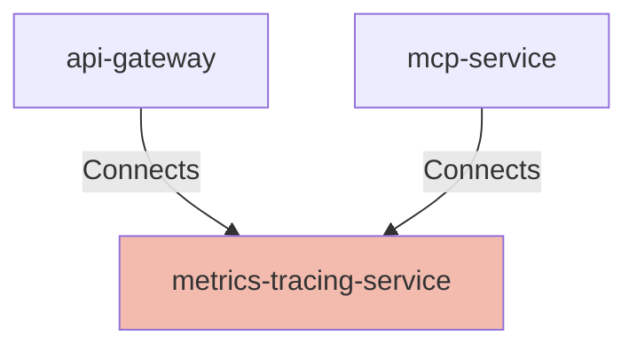

## Details

| Field               | Value                    |
|---------------------|--------------------------|
| **Unique ID**       | metrics-tracing-service                   |
| **Node Type**       | system             |
| **Name**            | Metrics and Tracing Service                 |
| **Description**     | OpenTelemetry Collector for metrics, distributed traces, SLIs/SLOs, and trace sampling.          |

## Interfaces
        

            <table>
                <thead>
                <tr>
                    <th>Key</th>
                    <th>Value</th>
                </tr>
                </thead>
                <tbody>
                <tr>
                    <td>
                        <b>UniqueId</b>
                    </td>
                    <td>
                        otel-otlp
                            </td>
                </tr>
                <tr>
                    <td>
                        <b>AdditionalProperties</b>
                    </td>
                    <td>
                        

                            <table>
                                <thead>
                                <tr>
                                    <th>Key</th>
                                    <th>Value</th>
                                </tr>
                                </thead>
                                <tbody>
                                </tbody>
                            </table>
                        

                    </td>
                </tr>
                </tbody>
            </table>
        

        

            <table>
                <thead>
                <tr>
                    <th>Key</th>
                    <th>Value</th>
                </tr>
                </thead>
                <tbody>
                <tr>
                    <td>
                        <b>UniqueId</b>
                    </td>
                    <td>
                        metrics-intake
                            </td>
                </tr>
                <tr>
                    <td>
                        <b>AdditionalProperties</b>
                    </td>
                    <td>
                        

                            <table>
                                <thead>
                                <tr>
                                    <th>Key</th>
                                    <th>Value</th>
                                </tr>
                                </thead>
                                <tbody>
                                </tbody>
                            </table>
                        

                    </td>
                </tr>
                </tbody>
            </table>
        

        

            <table>
                <thead>
                <tr>
                    <th>Key</th>
                    <th>Value</th>
                </tr>
                </thead>
                <tbody>
                <tr>
                    <td>
                        <b>UniqueId</b>
                    </td>
                    <td>
                        tracing-intake
                            </td>
                </tr>
                <tr>
                    <td>
                        <b>AdditionalProperties</b>
                    </td>
                    <td>
                        

                            <table>
                                <thead>
                                <tr>
                                    <th>Key</th>
                                    <th>Value</th>
                                </tr>
                                </thead>
                                <tbody>
                                </tbody>
                            </table>
                        

                    </td>
                </tr>
                </tbody>
            </table>
        

## Related Nodes

## Controls

        ### Ai Output Validation

        Validation and monitoring of AI outputs to detect hallucinations and inaccurate responses.

            

                <table>
                    <thead>
                    <tr>
                        <th>Key</th>
                        <th>Value</th>
                    </tr>
                    </thead>
                    <tbody>
                    </tbody>
                </table>
            

            

                <table>
                    <thead>
                    <tr>
                        <th>Key</th>
                        <th>Value</th>
                    </tr>
                    </thead>
                    <tbody>
                    <tr>
                        <td>
                            <b>$id</b>
                        </td>
                        <td>
                            https://air-governance-framework.finos.org/calm/AIR-DET-004
                                </td>
                    </tr>
                    <tr>
                        <td>
                            <b>Control Id</b>
                        </td>
                        <td>
                            AIR-DET-004
                                </td>
                    </tr>
                    <tr>
                        <td>
                            <b>Control Name</b>
                        </td>
                        <td>
                            AI System Observability
                                </td>
                    </tr>
                    <tr>
                        <td>
                            <b>Category</b>
                        </td>
                        <td>
                            Detective
                                </td>
                    </tr>
                    <tr>
                        <td>
                            <b>Description</b>
                        </td>
                        <td>
                            Implement comprehensive monitoring to detect anomalies and security breaches.
                                </td>
                    </tr>
                    <tr>
                        <td>
                            <b>Reference Url</b>
                        </td>
                        <td>
                            https://air-governance-framework.finos.org/mitigations/mi-4_ai-system-observability.html
                                </td>
                    </tr>
                    <tr>
                        <td>
                            <b>Threats Mitigated</b>
                        </td>
                        <td>
                            <ul>
                                <li>AIR-OP-004</li>
                                <li>AIR-OP-015</li>
                            </ul>
                        </td>
                    </tr>
                    <tr>
                        <td>
                            <b>Implementation Requirements</b>
                        </td>
                        <td>
                            

                                <table>
                                    <thead>
                                    <tr>
                                        <th>Key</th>
                                        <th>Value</th>
                                    </tr>
                                    </thead>
                                    <tbody>
                                    <tr>
                                        <td>
                                            <b>Logging</b>
                                        </td>
                                        <td>
                                            

                                                <table>
                                                    <thead>
                                                    <tr>
                                                        <th>Key</th>
                                                        <th>Value</th>
                                                    </tr>
                                                    </thead>
                                                    <tbody>
                                                    <tr>
                                                        <td>
                                                            <b>Categories</b>
                                                        </td>
                                                        <td>
                                                            <ul>
                                                                <li>auth</li>
                                                                <li>policy</li>
                                                                <li>tool-call</li>
                                                                <li>admin</li>
                                                                <li>error</li>
                                                                <li>request</li>
                                                            </ul>
                                                        </td>
                                                    </tr>
                                                    <tr>
                                                        <td>
                                                            <b>Format</b>
                                                        </td>
                                                        <td>
                                                            json
                                                                </td>
                                                    </tr>
                                                    <tr>
                                                        <td>
                                                            <b>Pii Scrubbing</b>
                                                        </td>
                                                        <td>
                                                            true
                                                                </td>
                                                    </tr>
                                                    <tr>
                                                        <td>
                                                            <b>Redaction Ruleset</b>
                                                        </td>
                                                        <td>
                                                            pii-v1
                                                                </td>
                                                    </tr>
                                                    <tr>
                                                        <td>
                                                            <b>Retention Days</b>
                                                        </td>
                                                        <td>
                                                            365
                                                                </td>
                                                    </tr>
                                                    </tbody>
                                                </table>
                                            

                                        </td>
                                    </tr>
                                    <tr>
                                        <td>
                                            <b>Metrics</b>
                                        </td>
                                        <td>
                                            

                                                <table>
                                                    <thead>
                                                    <tr>
                                                        <th>Key</th>
                                                        <th>Value</th>
                                                    </tr>
                                                    </thead>
                                                    <tbody>
                                                    <tr>
                                                        <td>
                                                            <b>Framework</b>
                                                        </td>
                                                        <td>
                                                            OpenTelemetry
                                                                </td>
                                                    </tr>
                                                    <tr>
                                                        <td>
                                                            <b>Standard Metrics</b>
                                                        </td>
                                                        <td>
                                                            <ul>
                                                                <li>latency</li>
                                                                <li>error_rate</li>
                                                                <li>throughput</li>
                                                                <li>availability</li>
                                                            </ul>
                                                        </td>
                                                    </tr>
                                                    <tr>
                                                        <td>
                                                            <b>Slo Targets</b>
                                                        </td>
                                                        <td>
                                                            

                                                                <table>
                                                                    <thead>
                                                                    <tr>
                                                                        <th>Key</th>
                                                                        <th>Value</th>
                                                                    </tr>
                                                                    </thead>
                                                                    <tbody>
                                                                    <tr>
                                                                        <td>
                                                                            <b>Availability</b>
                                                                        </td>
                                                                        <td>
                                                                            99.9%
                                                                                </td>
                                                                    </tr>
                                                                    <tr>
                                                                        <td>
                                                                            <b>P95 Latency Ms</b>
                                                                        </td>
                                                                        <td>
                                                                            300
                                                                                </td>
                                                                    </tr>
                                                                    </tbody>
                                                                </table>
                                                            

                                                        </td>
                                                    </tr>
                                                    </tbody>
                                                </table>
                                            

                                        </td>
                                    </tr>
                                    <tr>
                                        <td>
                                            <b>Tracing</b>
                                        </td>
                                        <td>
                                            

                                                <table>
                                                    <thead>
                                                    <tr>
                                                        <th>Key</th>
                                                        <th>Value</th>
                                                    </tr>
                                                    </thead>
                                                    <tbody>
                                                    <tr>
                                                        <td>
                                                            <b>Enabled</b>
                                                        </td>
                                                        <td>
                                                            true
                                                                </td>
                                                    </tr>
                                                    <tr>
                                                        <td>
                                                            <b>Sampling Rate</b>
                                                        </td>
                                                        <td>
                                                            0.2
                                                                </td>
                                                    </tr>
                                                    </tbody>
                                                </table>
                                            

                                        </td>
                                    </tr>
                                    </tbody>
                                </table>
                            

                        </td>
                    </tr>
                    </tbody>
                </table>
            

        ### Observability Metrics Tracing

        Metrics and distributed tracing via OpenTelemetry with SLIs/SLOs and trace sampling.

            

                <table>
                    <thead>
                    <tr>
                        <th>Key</th>
                        <th>Value</th>
                    </tr>
                    </thead>
                    <tbody>
                    <tr>
                        <td>
                            <b>$id</b>
                        </td>
                        <td>
                            https://air-governance-framework.finos.org/calm/AIR-DET-004
                                </td>
                    </tr>
                    <tr>
                        <td>
                            <b>Control Id</b>
                        </td>
                        <td>
                            AIR-DET-004
                                </td>
                    </tr>
                    <tr>
                        <td>
                            <b>Control Name</b>
                        </td>
                        <td>
                            AI System Observability
                                </td>
                    </tr>
                    <tr>
                        <td>
                            <b>Category</b>
                        </td>
                        <td>
                            Detective
                                </td>
                    </tr>
                    <tr>
                        <td>
                            <b>Description</b>
                        </td>
                        <td>
                            Implement comprehensive monitoring to detect anomalies and security breaches.
                                </td>
                    </tr>
                    <tr>
                        <td>
                            <b>Reference Url</b>
                        </td>
                        <td>
                            https://air-governance-framework.finos.org/mitigations/mi-4_ai-system-observability.html
                                </td>
                    </tr>
                    <tr>
                        <td>
                            <b>Threats Mitigated</b>
                        </td>
                        <td>
                            <ul>
                                <li>AIR-OP-004</li>
                                <li>AIR-OP-015</li>
                            </ul>
                        </td>
                    </tr>
                    <tr>
                        <td>
                            <b>Implementation Requirements</b>
                        </td>
                        <td>
                            

                                <table>
                                    <thead>
                                    <tr>
                                        <th>Key</th>
                                        <th>Value</th>
                                    </tr>
                                    </thead>
                                    <tbody>
                                    <tr>
                                        <td>
                                            <b>Logging</b>
                                        </td>
                                        <td>
                                            

                                                <table>
                                                    <thead>
                                                    <tr>
                                                        <th>Key</th>
                                                        <th>Value</th>
                                                    </tr>
                                                    </thead>
                                                    <tbody>
                                                    <tr>
                                                        <td>
                                                            <b>Categories</b>
                                                        </td>
                                                        <td>
                                                            <ul>
                                                                <li>auth</li>
                                                                <li>policy</li>
                                                                <li>tool-call</li>
                                                                <li>admin</li>
                                                                <li>error</li>
                                                                <li>request</li>
                                                            </ul>
                                                        </td>
                                                    </tr>
                                                    <tr>
                                                        <td>
                                                            <b>Format</b>
                                                        </td>
                                                        <td>
                                                            json
                                                                </td>
                                                    </tr>
                                                    <tr>
                                                        <td>
                                                            <b>Pii Scrubbing</b>
                                                        </td>
                                                        <td>
                                                            true
                                                                </td>
                                                    </tr>
                                                    <tr>
                                                        <td>
                                                            <b>Redaction Ruleset</b>
                                                        </td>
                                                        <td>
                                                            pii-v1
                                                                </td>
                                                    </tr>
                                                    <tr>
                                                        <td>
                                                            <b>Retention Days</b>
                                                        </td>
                                                        <td>
                                                            365
                                                                </td>
                                                    </tr>
                                                    </tbody>
                                                </table>
                                            

                                        </td>
                                    </tr>
                                    <tr>
                                        <td>
                                            <b>Metrics</b>
                                        </td>
                                        <td>
                                            

                                                <table>
                                                    <thead>
                                                    <tr>
                                                        <th>Key</th>
                                                        <th>Value</th>
                                                    </tr>
                                                    </thead>
                                                    <tbody>
                                                    <tr>
                                                        <td>
                                                            <b>Framework</b>
                                                        </td>
                                                        <td>
                                                            OpenTelemetry
                                                                </td>
                                                    </tr>
                                                    <tr>
                                                        <td>
                                                            <b>Standard Metrics</b>
                                                        </td>
                                                        <td>
                                                            <ul>
                                                                <li>latency</li>
                                                                <li>error_rate</li>
                                                                <li>throughput</li>
                                                                <li>availability</li>
                                                            </ul>
                                                        </td>
                                                    </tr>
                                                    <tr>
                                                        <td>
                                                            <b>Slo Targets</b>
                                                        </td>
                                                        <td>
                                                            

                                                                <table>
                                                                    <thead>
                                                                    <tr>
                                                                        <th>Key</th>
                                                                        <th>Value</th>
                                                                    </tr>
                                                                    </thead>
                                                                    <tbody>
                                                                    <tr>
                                                                        <td>
                                                                            <b>Availability</b>
                                                                        </td>
                                                                        <td>
                                                                            99.9%
                                                                                </td>
                                                                    </tr>
                                                                    <tr>
                                                                        <td>
                                                                            <b>P95 Latency Ms</b>
                                                                        </td>
                                                                        <td>
                                                                            300
                                                                                </td>
                                                                    </tr>
                                                                    </tbody>
                                                                </table>
                                                            

                                                        </td>
                                                    </tr>
                                                    </tbody>
                                                </table>
                                            

                                        </td>
                                    </tr>
                                    <tr>
                                        <td>
                                            <b>Tracing</b>
                                        </td>
                                        <td>
                                            

                                                <table>
                                                    <thead>
                                                    <tr>
                                                        <th>Key</th>
                                                        <th>Value</th>
                                                    </tr>
                                                    </thead>
                                                    <tbody>
                                                    <tr>
                                                        <td>
                                                            <b>Enabled</b>
                                                        </td>
                                                        <td>
                                                            true
                                                                </td>
                                                    </tr>
                                                    <tr>
                                                        <td>
                                                            <b>Sampling Rate</b>
                                                        </td>
                                                        <td>
                                                            0.2
                                                                </td>
                                                    </tr>
                                                    </tbody>
                                                </table>
                                            

                                        </td>
                                    </tr>
                                    </tbody>
                                </table>
                            

                        </td>
                    </tr>
                    </tbody>
                </table>
            

            

                <table>
                    <thead>
                    <tr>
                        <th>Key</th>
                        <th>Value</th>
                    </tr>
                    </thead>
                    <tbody>
                    </tbody>
                </table>
            

## Metadata
  _No Metadata defined._
