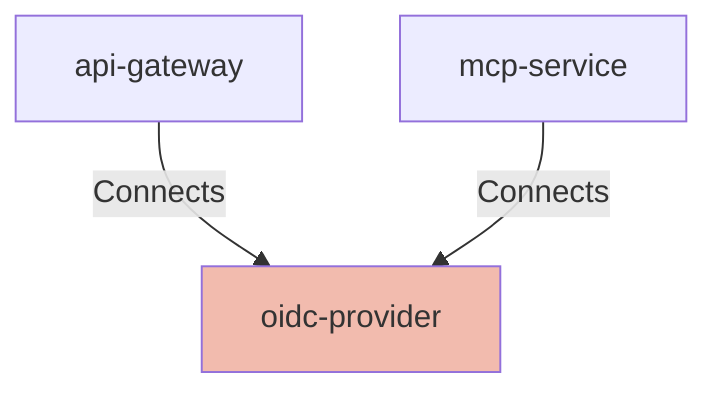

## Details

| Field               | Value                    |
|---------------------|--------------------------|
| **Unique ID**       | oidc-provider                   |
| **Node Type**       | service             |
| **Name**            | OIDC Provider                 |
| **Description**     | Centralized Identity Provider responsible for user authentication and token issuance.          |

## Interfaces
        

            <table>
                <thead>
                <tr>
                    <th>Key</th>
                    <th>Value</th>
                </tr>
                </thead>
                <tbody>
                <tr>
                    <td>
                        <b>UniqueId</b>
                    </td>
                    <td>
                        oidc-authorization
                            </td>
                </tr>
                <tr>
                    <td>
                        <b>AdditionalProperties</b>
                    </td>
                    <td>
                        

                            <table>
                                <thead>
                                <tr>
                                    <th>Key</th>
                                    <th>Value</th>
                                </tr>
                                </thead>
                                <tbody>
                                </tbody>
                            </table>
                        

                    </td>
                </tr>
                </tbody>
            </table>
        

        

            <table>
                <thead>
                <tr>
                    <th>Key</th>
                    <th>Value</th>
                </tr>
                </thead>
                <tbody>
                <tr>
                    <td>
                        <b>UniqueId</b>
                    </td>
                    <td>
                        oidc-jwks
                            </td>
                </tr>
                <tr>
                    <td>
                        <b>AdditionalProperties</b>
                    </td>
                    <td>
                        

                            <table>
                                <thead>
                                <tr>
                                    <th>Key</th>
                                    <th>Value</th>
                                </tr>
                                </thead>
                                <tbody>
                                </tbody>
                            </table>
                        

                    </td>
                </tr>
                </tbody>
            </table>
        

## Related Nodes

## Controls

        ### Oauth Authorization

        OAuth 2.1 authorization with OIDC, PKCE, and signed JWTs.

            

                <table>
                    <thead>
                    <tr>
                        <th>Key</th>
                        <th>Value</th>
                    </tr>
                    </thead>
                    <tbody>
                    <tr>
                        <td>
                            <b>$id</b>
                        </td>
                        <td>
                            https://air-governance-framework.finos.org/calm/AIR-PREV-012
                                </td>
                    </tr>
                    <tr>
                        <td>
                            <b>Control Id</b>
                        </td>
                        <td>
                            AIR-PREV-012
                                </td>
                    </tr>
                    <tr>
                        <td>
                            <b>Control Name</b>
                        </td>
                        <td>
                            Role-Based Access Control for AI Data
                                </td>
                    </tr>
                    <tr>
                        <td>
                            <b>Category</b>
                        </td>
                        <td>
                            Preventative
                                </td>
                    </tr>
                    <tr>
                        <td>
                            <b>Description</b>
                        </td>
                        <td>
                            Implement granular access controls for AI data and model access.
                                </td>
                    </tr>
                    <tr>
                        <td>
                            <b>Reference Url</b>
                        </td>
                        <td>
                            https://air-governance-framework.finos.org/mitigations/mi-12_role-based-access-control-for-ai-data.html
                                </td>
                    </tr>
                    <tr>
                        <td>
                            <b>Threats Mitigated</b>
                        </td>
                        <td>
                            <ul>
                                <li>AIR-SEC-002</li>
                            </ul>
                        </td>
                    </tr>
                    <tr>
                        <td>
                            <b>Implementation Requirements</b>
                        </td>
                        <td>
                            

                                <table>
                                    <thead>
                                    <tr>
                                        <th>Key</th>
                                        <th>Value</th>
                                    </tr>
                                    </thead>
                                    <tbody>
                                    <tr>
                                        <td>
                                            <b>Oauth Authorization</b>
                                        </td>
                                        <td>
                                            

                                                <table>
                                                    <thead>
                                                    <tr>
                                                        <th>Key</th>
                                                        <th>Value</th>
                                                    </tr>
                                                    </thead>
                                                    <tbody>
                                                    <tr>
                                                        <td>
                                                            <b>Scopes</b>
                                                        </td>
                                                        <td>
                                                            <ul>
                                                                <li>mcp:connect</li>
                                                                <li>mcp:tools:read</li>
                                                                <li>mcp:resources:read</li>
                                                            </ul>
                                                        </td>
                                                    </tr>
                                                    <tr>
                                                        <td>
                                                            <b>Pkce</b>
                                                        </td>
                                                        <td>
                                                            S256
                                                                </td>
                                                    </tr>
                                                    </tbody>
                                                </table>
                                            

                                        </td>
                                    </tr>
                                    <tr>
                                        <td>
                                            <b>Fine Grained Authorization</b>
                                        </td>
                                        <td>
                                            

                                                <table>
                                                    <thead>
                                                    <tr>
                                                        <th>Key</th>
                                                        <th>Value</th>
                                                    </tr>
                                                    </thead>
                                                    <tbody>
                                                    <tr>
                                                        <td>
                                                            <b>Policy Language</b>
                                                        </td>
                                                        <td>
                                                            rego
                                                                </td>
                                                    </tr>
                                                    <tr>
                                                        <td>
                                                            <b>Decision Ttl Seconds</b>
                                                        </td>
                                                        <td>
                                                            5
                                                                </td>
                                                    </tr>
                                                    <tr>
                                                        <td>
                                                            <b>Default Deny</b>
                                                        </td>
                                                        <td>
                                                            true
                                                                </td>
                                                    </tr>
                                                    <tr>
                                                        <td>
                                                            <b>Input Attributes</b>
                                                        </td>
                                                        <td>
                                                            <ul>
                                                                <li>user</li>
                                                                <li>groups</li>
                                                                <li>entitlements</li>
                                                                <li>resource</li>
                                                                <li>action</li>
                                                                <li>context</li>
                                                            </ul>
                                                        </td>
                                                    </tr>
                                                    </tbody>
                                                </table>
                                            

                                        </td>
                                    </tr>
                                    </tbody>
                                </table>
                            

                        </td>
                    </tr>
                    </tbody>
                </table>
            

## Metadata
  

      <table>
          <thead>
          <tr>
              <th>Key</th>
              <th>Value</th>
          </tr>
          </thead>
          <tbody>
          <tr>
              <td>
                  <b>BaseUrl</b>
              </td>
              <td>
                  https://auth.company.example
                      </td>
          </tr>
          <tr>
              <td>
                  <b>Oauth2</b>
              </td>
              <td>
                  

                      <table>
                          <thead>
                          <tr>
                              <th>Key</th>
                              <th>Value</th>
                          </tr>
                          </thead>
                          <tbody>
                          <tr>
                              <td>
                                  <b>Version</b>
                              </td>
                              <td>
                                  2.1
                                      </td>
                          </tr>
                          <tr>
                              <td>
                                  <b>Oidc</b>
                              </td>
                              <td>
                                  true
                                      </td>
                          </tr>
                          <tr>
                              <td>
                                  <b>AuthorizationEndpoint</b>
                              </td>
                              <td>
                                  https://auth.company.example/oauth2/v1/authorize
                                      </td>
                          </tr>
                          <tr>
                              <td>
                                  <b>TokenEndpoint</b>
                              </td>
                              <td>
                                  https://auth.company.example/oauth2/v1/token
                                      </td>
                          </tr>
                          <tr>
                              <td>
                                  <b>JwksUri</b>
                              </td>
                              <td>
                                  https://auth.company.example/oauth2/v1/keys
                                      </td>
                          </tr>
                          <tr>
                              <td>
                                  <b>MetadataEndpoint</b>
                              </td>
                              <td>
                                  https://auth.company.example/.well-known/openid-configuration
                                      </td>
                          </tr>
                          <tr>
                              <td>
                                  <b>SupportedFlows</b>
                              </td>
                              <td>
                                  

                                      <table>
                                          <thead>
                                          <tr>
                                              <th>Key</th>
                                              <th>Value</th>
                                          </tr>
                                          </thead>
                                          <tbody>
                                          <tr>
                                              <td>
                                                  <b>AuthorizationCode</b>
                                              </td>
                                              <td>
                                                  

                                                      <table>
                                                          <thead>
                                                          <tr>
                                                              <th>Key</th>
                                                              <th>Value</th>
                                                          </tr>
                                                          </thead>
                                                          <tbody>
                                                          <tr>
                                                              <td>
                                                                  <b>Enabled</b>
                                                              </td>
                                                              <td>
                                                                  true
                                                                      </td>
                                                          </tr>
                                                          <tr>
                                                              <td>
                                                                  <b>Pkce</b>
                                                              </td>
                                                              <td>
                                                                  required
                                                                      </td>
                                                          </tr>
                                                          <tr>
                                                              <td>
                                                                  <b>CodeChallengeMethods</b>
                                                              </td>
                                                              <td>
                                                                  <ul>
                                                                      <li>S256</li>
                                                                  </ul>
                                                              </td>
                                                          </tr>
                                                          </tbody>
                                                      </table>
                                                  

                                              </td>
                                          </tr>
                                          </tbody>
                                      </table>
                                  

                              </td>
                          </tr>
                          </tbody>
                      </table>
                  

              </td>
          </tr>
          </tbody>
      </table>
  

