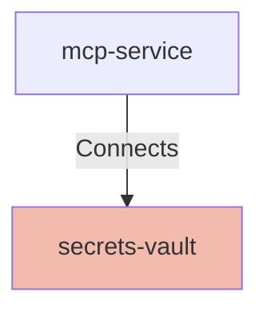

## Details

| Field               | Value                    |
|---------------------|--------------------------|
| **Unique ID**       | secrets-vault                   |
| **Node Type**       | service             |
| **Name**            | Secrets Management Vault                 |
| **Description**     | Secure storage for application secrets and credentials.          |

## Interfaces
        

            <table>
                <thead>
                <tr>
                    <th>Key</th>
                    <th>Value</th>
                </tr>
                </thead>
                <tbody>
                <tr>
                    <td>
                        <b>UniqueId</b>
                    </td>
                    <td>
                        vault-api
                            </td>
                </tr>
                <tr>
                    <td>
                        <b>AdditionalProperties</b>
                    </td>
                    <td>
                        

                            <table>
                                <thead>
                                <tr>
                                    <th>Key</th>
                                    <th>Value</th>
                                </tr>
                                </thead>
                                <tbody>
                                </tbody>
                            </table>
                        

                    </td>
                </tr>
                </tbody>
            </table>
        

## Related Nodes

## Controls

        ### Secrets Management

        Centralized secrets with short-lived credentials and rotation through a vault.

            

                <table>
                    <thead>
                    <tr>
                        <th>Key</th>
                        <th>Value</th>
                    </tr>
                    </thead>
                    <tbody>
                    <tr>
                        <td>
                            <b>$id</b>
                        </td>
                        <td>
                            https://air-governance-framework.finos.org/calm/AIR-PREV-001
                                </td>
                    </tr>
                    <tr>
                        <td>
                            <b>Control Id</b>
                        </td>
                        <td>
                            AIR-PREV-001
                                </td>
                    </tr>
                    <tr>
                        <td>
                            <b>Control Name</b>
                        </td>
                        <td>
                            AI System Risk Assessment
                                </td>
                    </tr>
                    <tr>
                        <td>
                            <b>Category</b>
                        </td>
                        <td>
                            Preventative
                                </td>
                    </tr>
                    <tr>
                        <td>
                            <b>Description</b>
                        </td>
                        <td>
                            Conduct comprehensive risk assessments for AI systems before deployment.
                                </td>
                    </tr>
                    <tr>
                        <td>
                            <b>Reference Url</b>
                        </td>
                        <td>
                            https://air-governance-framework.finos.org/mitigations/mi-1_ai-system-risk-assessment.html
                                </td>
                    </tr>
                    <tr>
                        <td>
                            <b>Threats Mitigated</b>
                        </td>
                        <td>
                            <ul>
                            </ul>
                        </td>
                    </tr>
                    <tr>
                        <td>
                            <b>Implementation Requirements</b>
                        </td>
                        <td>
                            

                                <table>
                                    <thead>
                                    <tr>
                                        <th>Key</th>
                                        <th>Value</th>
                                    </tr>
                                    </thead>
                                    <tbody>
                                    </tbody>
                                </table>
                            

                        </td>
                    </tr>
                    </tbody>
                </table>
            

            

                <table>
                    <thead>
                    <tr>
                        <th>Key</th>
                        <th>Value</th>
                    </tr>
                    </thead>
                    <tbody>
                    <tr>
                        <td>
                            <b>$id</b>
                        </td>
                        <td>
                            https://air-governance-framework.finos.org/calm/AIR-PREV-002
                                </td>
                    </tr>
                    <tr>
                        <td>
                            <b>Control Id</b>
                        </td>
                        <td>
                            AIR-PREV-002
                                </td>
                    </tr>
                    <tr>
                        <td>
                            <b>Control Name</b>
                        </td>
                        <td>
                            Data Filtering From External Knowledge Bases
                                </td>
                    </tr>
                    <tr>
                        <td>
                            <b>Category</b>
                        </td>
                        <td>
                            Preventative
                                </td>
                    </tr>
                    <tr>
                        <td>
                            <b>Description</b>
                        </td>
                        <td>
                            Sanitize and filter data from external sources to prevent sensitive information leakage.
                                </td>
                    </tr>
                    <tr>
                        <td>
                            <b>Reference Url</b>
                        </td>
                        <td>
                            https://air-governance-framework.finos.org/mitigations/mi-2_data-filtering-from-external-knowledge-bases.html
                                </td>
                    </tr>
                    <tr>
                        <td>
                            <b>Threats Mitigated</b>
                        </td>
                        <td>
                            <ul>
                                <li>AIR-SEC-002</li>
                            </ul>
                        </td>
                    </tr>
                    <tr>
                        <td>
                            <b>Implementation Requirements</b>
                        </td>
                        <td>
                            

                                <table>
                                    <thead>
                                    <tr>
                                        <th>Key</th>
                                        <th>Value</th>
                                    </tr>
                                    </thead>
                                    <tbody>
                                    <tr>
                                        <td>
                                            <b>Data Governance</b>
                                        </td>
                                        <td>
                                            

                                                <table>
                                                    <thead>
                                                    <tr>
                                                        <th>Key</th>
                                                        <th>Value</th>
                                                    </tr>
                                                    </thead>
                                                    <tbody>
                                                    <tr>
                                                        <td>
                                                            <b>Classification</b>
                                                        </td>
                                                        <td>
                                                            <ul>
                                                                <li>public</li>
                                                                <li>internal</li>
                                                                <li>confidential</li>
                                                                <li>restricted</li>
                                                            </ul>
                                                        </td>
                                                    </tr>
                                                    <tr>
                                                        <td>
                                                            <b>Default Classification</b>
                                                        </td>
                                                        <td>
                                                            internal
                                                                </td>
                                                    </tr>
                                                    <tr>
                                                        <td>
                                                            <b>Purpose Limitation</b>
                                                        </td>
                                                        <td>
                                                            true
                                                                </td>
                                                    </tr>
                                                    <tr>
                                                        <td>
                                                            <b>Data Minimization</b>
                                                        </td>
                                                        <td>
                                                            true
                                                                </td>
                                                    </tr>
                                                    <tr>
                                                        <td>
                                                            <b>Access Review Days</b>
                                                        </td>
                                                        <td>
                                                            90
                                                                </td>
                                                    </tr>
                                                    <tr>
                                                        <td>
                                                            <b>Retention Policy</b>
                                                        </td>
                                                        <td>
                                                            

                                                                <table>
                                                                    <thead>
                                                                    <tr>
                                                                        <th>Key</th>
                                                                        <th>Value</th>
                                                                    </tr>
                                                                    </thead>
                                                                    <tbody>
                                                                    <tr>
                                                                        <td>
                                                                            <b>Internal</b>
                                                                        </td>
                                                                        <td>
                                                                            365
                                                                                </td>
                                                                    </tr>
                                                                    <tr>
                                                                        <td>
                                                                            <b>Confidential</b>
                                                                        </td>
                                                                        <td>
                                                                            180
                                                                                </td>
                                                                    </tr>
                                                                    <tr>
                                                                        <td>
                                                                            <b>Restricted</b>
                                                                        </td>
                                                                        <td>
                                                                            90
                                                                                </td>
                                                                    </tr>
                                                                    </tbody>
                                                                </table>
                                                            

                                                        </td>
                                                    </tr>
                                                    </tbody>
                                                </table>
                                            

                                        </td>
                                    </tr>
                                    </tbody>
                                </table>
                            

                        </td>
                    </tr>
                    </tbody>
                </table>
            

## Metadata
  _No Metadata defined._
