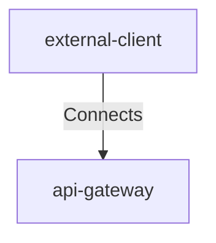

## Details

| Field               | Value                    |
|---------------------|--------------------------|
| **Unique ID**       | client-to-gateway                   |
| **Description**      |  Initial MCP request over a secure channel.   |

## Related Nodes

## Controls

        ### Edge Protection

        WAF, rate limiting, and TLS at the gateway to mitigate abuse and common attacks.

            

                <table>
                    <thead>
                    <tr>
                        <th>Key</th>
                        <th>Value</th>
                    </tr>
                    </thead>
                    <tbody>
                    <tr>
                        <td>
                            <b>$id</b>
                        </td>
                        <td>
                            https://air-governance-framework.finos.org/calm/AIR-PREV-003
                                </td>
                    </tr>
                    <tr>
                        <td>
                            <b>Control Id</b>
                        </td>
                        <td>
                            AIR-PREV-003
                                </td>
                    </tr>
                    <tr>
                        <td>
                            <b>Control Name</b>
                        </td>
                        <td>
                            User/App/Model Firewalling/Filtering
                                </td>
                    </tr>
                    <tr>
                        <td>
                            <b>Category</b>
                        </td>
                        <td>
                            Preventative
                                </td>
                    </tr>
                    <tr>
                        <td>
                            <b>Description</b>
                        </td>
                        <td>
                            Monitor and filter interactions between users, applications, and AI models.
                                </td>
                    </tr>
                    <tr>
                        <td>
                            <b>Reference Url</b>
                        </td>
                        <td>
                            https://air-governance-framework.finos.org/mitigations/mi-3_user-app-model-firewalling-filtering.html
                                </td>
                    </tr>
                    <tr>
                        <td>
                            <b>Threats Mitigated</b>
                        </td>
                        <td>
                            <ul>
                                <li>AIR-SEC-010</li>
                            </ul>
                        </td>
                    </tr>
                    <tr>
                        <td>
                            <b>Implementation Requirements</b>
                        </td>
                        <td>
                            

                                <table>
                                    <thead>
                                    <tr>
                                        <th>Key</th>
                                        <th>Value</th>
                                    </tr>
                                    </thead>
                                    <tbody>
                                    <tr>
                                        <td>
                                            <b>Edge Protection</b>
                                        </td>
                                        <td>
                                            

                                                <table>
                                                    <thead>
                                                    <tr>
                                                        <th>Key</th>
                                                        <th>Value</th>
                                                    </tr>
                                                    </thead>
                                                    <tbody>
                                                    <tr>
                                                        <td>
                                                            <b>Rate Limit</b>
                                                        </td>
                                                        <td>
                                                            

                                                                <table>
                                                                    <thead>
                                                                    <tr>
                                                                        <th>Key</th>
                                                                        <th>Value</th>
                                                                    </tr>
                                                                    </thead>
                                                                    <tbody>
                                                                    <tr>
                                                                        <td>
                                                                            <b>Burst</b>
                                                                        </td>
                                                                        <td>
                                                                            100
                                                                                </td>
                                                                    </tr>
                                                                    <tr>
                                                                        <td>
                                                                            <b>Per Minute</b>
                                                                        </td>
                                                                        <td>
                                                                            1000
                                                                                </td>
                                                                    </tr>
                                                                    </tbody>
                                                                </table>
                                                            

                                                        </td>
                                                    </tr>
                                                    <tr>
                                                        <td>
                                                            <b>Waf Ruleset</b>
                                                        </td>
                                                        <td>
                                                            owasp-core
                                                                </td>
                                                    </tr>
                                                    <tr>
                                                        <td>
                                                            <b>Tls</b>
                                                        </td>
                                                        <td>
                                                            

                                                                <table>
                                                                    <thead>
                                                                    <tr>
                                                                        <th>Key</th>
                                                                        <th>Value</th>
                                                                    </tr>
                                                                    </thead>
                                                                    <tbody>
                                                                    <tr>
                                                                        <td>
                                                                            <b>Min</b>
                                                                        </td>
                                                                        <td>
                                                                            TLSv1.2
                                                                                </td>
                                                                    </tr>
                                                                    <tr>
                                                                        <td>
                                                                            <b>Hsts</b>
                                                                        </td>
                                                                        <td>
                                                                            true
                                                                                </td>
                                                                    </tr>
                                                                    </tbody>
                                                                </table>
                                                            

                                                        </td>
                                                    </tr>
                                                    </tbody>
                                                </table>
                                            

                                        </td>
                                    </tr>
                                    <tr>
                                        <td>
                                            <b>Prompt Injection Protection</b>
                                        </td>
                                        <td>
                                            

                                                <table>
                                                    <thead>
                                                    <tr>
                                                        <th>Key</th>
                                                        <th>Value</th>
                                                    </tr>
                                                    </thead>
                                                    <tbody>
                                                    <tr>
                                                        <td>
                                                            <b>Content Filtering</b>
                                                        </td>
                                                        <td>
                                                            true
                                                                </td>
                                                    </tr>
                                                    <tr>
                                                        <td>
                                                            <b>Tool Allowlist</b>
                                                        </td>
                                                        <td>
                                                            true
                                                                </td>
                                                    </tr>
                                                    <tr>
                                                        <td>
                                                            <b>Input Validation</b>
                                                        </td>
                                                        <td>
                                                            strict
                                                                </td>
                                                    </tr>
                                                    <tr>
                                                        <td>
                                                            <b>Prompt Sanitization</b>
                                                        </td>
                                                        <td>
                                                            true
                                                                </td>
                                                    </tr>
                                                    </tbody>
                                                </table>
                                            

                                        </td>
                                    </tr>
                                    </tbody>
                                </table>
                            

                        </td>
                    </tr>
                    </tbody>
                </table>
            

            

                <table>
                    <thead>
                    <tr>
                        <th>Key</th>
                        <th>Value</th>
                    </tr>
                    </thead>
                    <tbody>
                    </tbody>
                </table>
            

        ### Oauth Authorization

        OAuth 2.1 authorization with OIDC, PKCE, and signed JWTs.

            

                <table>
                    <thead>
                    <tr>
                        <th>Key</th>
                        <th>Value</th>
                    </tr>
                    </thead>
                    <tbody>
                    <tr>
                        <td>
                            <b>$id</b>
                        </td>
                        <td>
                            https://air-governance-framework.finos.org/calm/AIR-PREV-012
                                </td>
                    </tr>
                    <tr>
                        <td>
                            <b>Control Id</b>
                        </td>
                        <td>
                            AIR-PREV-012
                                </td>
                    </tr>
                    <tr>
                        <td>
                            <b>Control Name</b>
                        </td>
                        <td>
                            Role-Based Access Control for AI Data
                                </td>
                    </tr>
                    <tr>
                        <td>
                            <b>Category</b>
                        </td>
                        <td>
                            Preventative
                                </td>
                    </tr>
                    <tr>
                        <td>
                            <b>Description</b>
                        </td>
                        <td>
                            Implement granular access controls for AI data and model access.
                                </td>
                    </tr>
                    <tr>
                        <td>
                            <b>Reference Url</b>
                        </td>
                        <td>
                            https://air-governance-framework.finos.org/mitigations/mi-12_role-based-access-control-for-ai-data.html
                                </td>
                    </tr>
                    <tr>
                        <td>
                            <b>Threats Mitigated</b>
                        </td>
                        <td>
                            <ul>
                                <li>AIR-SEC-002</li>
                            </ul>
                        </td>
                    </tr>
                    <tr>
                        <td>
                            <b>Implementation Requirements</b>
                        </td>
                        <td>
                            

                                <table>
                                    <thead>
                                    <tr>
                                        <th>Key</th>
                                        <th>Value</th>
                                    </tr>
                                    </thead>
                                    <tbody>
                                    <tr>
                                        <td>
                                            <b>Oauth Authorization</b>
                                        </td>
                                        <td>
                                            

                                                <table>
                                                    <thead>
                                                    <tr>
                                                        <th>Key</th>
                                                        <th>Value</th>
                                                    </tr>
                                                    </thead>
                                                    <tbody>
                                                    <tr>
                                                        <td>
                                                            <b>Scopes</b>
                                                        </td>
                                                        <td>
                                                            <ul>
                                                                <li>mcp:connect</li>
                                                                <li>mcp:tools:read</li>
                                                                <li>mcp:resources:read</li>
                                                            </ul>
                                                        </td>
                                                    </tr>
                                                    <tr>
                                                        <td>
                                                            <b>Pkce</b>
                                                        </td>
                                                        <td>
                                                            S256
                                                                </td>
                                                    </tr>
                                                    </tbody>
                                                </table>
                                            

                                        </td>
                                    </tr>
                                    <tr>
                                        <td>
                                            <b>Fine Grained Authorization</b>
                                        </td>
                                        <td>
                                            

                                                <table>
                                                    <thead>
                                                    <tr>
                                                        <th>Key</th>
                                                        <th>Value</th>
                                                    </tr>
                                                    </thead>
                                                    <tbody>
                                                    <tr>
                                                        <td>
                                                            <b>Policy Language</b>
                                                        </td>
                                                        <td>
                                                            rego
                                                                </td>
                                                    </tr>
                                                    <tr>
                                                        <td>
                                                            <b>Decision Ttl Seconds</b>
                                                        </td>
                                                        <td>
                                                            5
                                                                </td>
                                                    </tr>
                                                    <tr>
                                                        <td>
                                                            <b>Default Deny</b>
                                                        </td>
                                                        <td>
                                                            true
                                                                </td>
                                                    </tr>
                                                    <tr>
                                                        <td>
                                                            <b>Input Attributes</b>
                                                        </td>
                                                        <td>
                                                            <ul>
                                                                <li>user</li>
                                                                <li>groups</li>
                                                                <li>entitlements</li>
                                                                <li>resource</li>
                                                                <li>action</li>
                                                                <li>context</li>
                                                            </ul>
                                                        </td>
                                                    </tr>
                                                    </tbody>
                                                </table>
                                            

                                        </td>
                                    </tr>
                                    </tbody>
                                </table>
                            

                        </td>
                    </tr>
                    </tbody>
                </table>
            

## Metadata
  

      <table>
          <thead>
          <tr>
              <th>Key</th>
              <th>Value</th>
          </tr>
          </thead>
          <tbody>
          <tr>
              <td>
                  <b>Authentication</b>
              </td>
              <td>
                  OIDC Authorization Code Flow
                      </td>
          </tr>
          <tr>
              <td>
                  <b>Data</b>
              </td>
              <td>
                  <ul>
                      <li>MCP Request Body</li>
                      <li>Bearer Token (JWT)</li>
                  </ul>
              </td>
          </tr>
          </tbody>
      </table>
  

