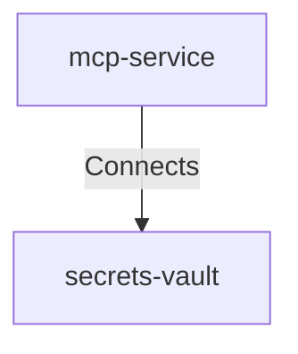

## Details

| Field               | Value                    |
|---------------------|--------------------------|
| **Unique ID**       | mcp-to-vault                   |
| **Description**      |  MCP service retrieves secrets at startup and on demand.   |

## Related Nodes

## Controls
    _No controls defined._

## Metadata
  

      <table>
          <thead>
          <tr>
              <th>Key</th>
              <th>Value</th>
          </tr>
          </thead>
          <tbody>
          <tr>
              <td>
                  <b>Authentication</b>
              </td>
              <td>
                  SPIFFE/mTLS
                      </td>
          </tr>
          <tr>
              <td>
                  <b>Air</b>
              </td>
              <td>
                  

                      <table>
                          <thead>
                          <tr>
                              <th>Key</th>
                              <th>Value</th>
                          </tr>
                          </thead>
                          <tbody>
                          <tr>
                              <td>
                                  <b>Threats</b>
                              </td>
                              <td>
                                  <ul>
                                      <li>AIR-SEC-001</li>
                                      <li>AIR-SEC-002</li>
                                  </ul>
                              </td>
                          </tr>
                          <tr>
                              <td>
                                  <b>Controls</b>
                              </td>
                              <td>
                                  <ul>
                                      <li>AIR-PREV-001</li>
                                      <li>AIR-PREV-002</li>
                                  </ul>
                              </td>
                          </tr>
                          </tbody>
                      </table>
                  

              </td>
          </tr>
          </tbody>
      </table>
  

